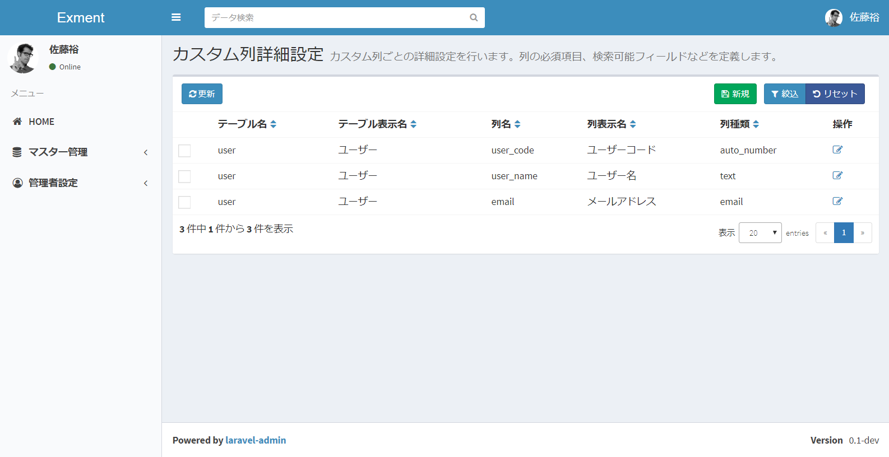
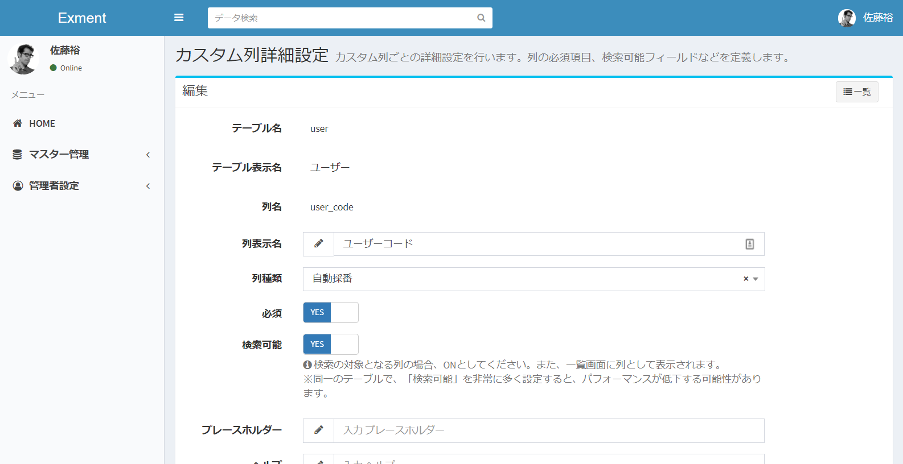
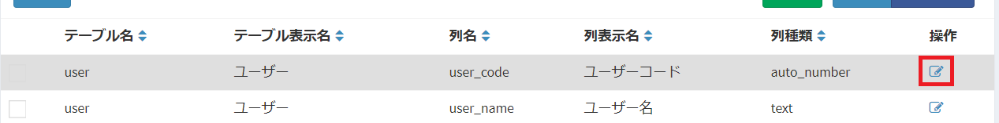
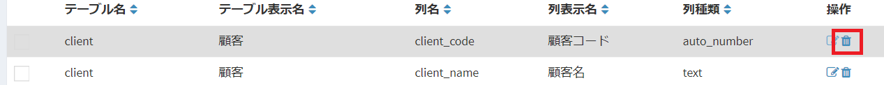
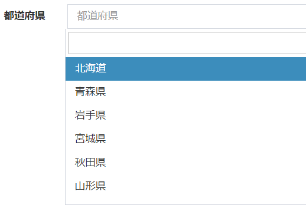

# Custom column management
We will manage the columns that custom tables have, "custom columns".

## Display page
- On the Custom Table screen, put a check in the table you want to change and click "Advanced Column Settings" in "Move Page".  

- This will display a list of the columns of the custom table you checked.

## Add a new column
- On the "Custom Column Detail Settings" screen, click the "New" button at the top right of the page.

- Custom column New addition screen will be displayed, enter necessary information.

## Save
After filling in the settings, please click "Send".

## Edit
If you want to edit a column, please click the "Edit" link in the corresponding line.

## Delete
If you want to delete a column, please click the "Delete" link in the corresponding line.

**  * However, columns installed on the system can not be deleted.  **

## Detailed explanation of entries (common)
- Column type: The type of column to be set. The contents registered in this item are applied to the form when data is registered.
    - 1 line text: 1 line text (text box).
    - Multi-line text: Multi-line text (text area).
    - URL: URL.
    - E-mail address: This is your e-mail address.
    - Integer: This is a form that allows you to enter only integers. Also, in the data registration form, "+" and "-" buttons are displayed on the left and right of the item, and you can raise or lower the value by clicking.
    - Decimal: This is a form that can input only decimal.
    - Date: It becomes item of date. In the data registration form, you can change the date from the calendar.
    - Time: It becomes item of time. In the data registration form, you can change the time from the clock.
    - Date and time: It becomes item of date and time. In the data registration form, you can change the date and time from the calendar and clock.
    - Choice: The list of choices is the same as the value and heading.
    - Option (Create value / heading): It becomes a list of alternatives with different values ​​and headings.
    - Choice (selected from the list of values ​​of other tables): Creates an option in which the option is an item of another table.
    - YES/NO: Create a switch to switch between "YES" and "NO". When registering data, 1 is registered as YES, 0 is registered as NO.
    - 2 value selection: Create a switch to switch between the two values. You can also change the value when registering data.
    - Automatic numbering: Create values ​​such as UUID and random character string when creating data.
    - Image: It is an item to upload images.
    - File: This is the item to upload the file.
    - User: The choice to select the system user.
    - Organization: An option to select the organization of the system.
    - Document: It becomes a document attached to that data.

- Required: Select whether the field is required. If it is set to YES, it becomes a required item on the data entry screen, and an error is displayed if it is not filled in.

- Searchable: If set to YES, it will be the search target of the search word entered in the search bar at the top of the page. If the column you want to search on the search screen, such as various codes and various names, please set it to YES.
** Also displayed as a column on the list screen on the data list screen. **

- Placeholder: A string that you register as a placeholder in a form field.

- Help: Contents displayed as information below the form item.

- Use with labels: When set to YES, when displaying this table as a choice in the search box at the top of the page, it is displayed as the heading (label) of this table item.
* If "YES" is selected for "Use with label" items in the same table, the first item in the order is displayed as a label.

## Detailed explanation of entries (by column type)
- Maximum number of characters (1 line text, multiline text): The maximum number of characters that can be filled in form fields. An error will occur if it is over.

- Minimum value (integer, decimal): The minimum value that can be entered in the form field. An error will occur if you send below that value. If it is blank, it will not check the minimum value.

- Maximum value (integer, decimal): The maximum value that can be entered in the form field. An error will occur if it is sent over that value. If it is not filled in, it will not check the maximum value.

- Choice (choices, options (value / heading is registered)): Register choices to be displayed as candidates in form items. Register multiple candidates with line breaks delimited.  
If you have selected "choices (value / headline)" in the column type, the first column becomes the value and the second column becomes the heading with the comma as the column delimiter.  
  
↓  
  
When saving data in a form, the value in the first column is saved in the database.

- Target table (choice (selected from the list of values ​​of other tables)): In the form field, specify the table to be displayed as a choice choice.

- Number assignment (automatic number assignment): When registering data, select the type you want to assign.
    - Format: Registers the number assignment in the format specified by the user.
    - Random (license code): Register a random character string of 25 characters with 5 characters × 5.
    - Random (UUID): Registers a random character string of 32 digits in total.

- Number of digits (auto numbering): The number of digits to be registered as data during automatic number assignment. Register the shortfall with 0 filling.

- Allow Multiple Selection: Set to YES if you make multiple choices for images, files, and choice items.

## Rules for automatic number assignment format
If you set the column type to "Automatic numbering" and the numbering type (automatic numbering) to "Format", you can register automatic number assignment with user's own rules.

| Item | Description |
| ---- | ---- |
| ${Y} | The year of data registration is set with 4 digits. (Example: 2018) |
| ${Y:(integer)} | The year when data is registered is set with the specified number of digits of the integer. (Example: if you enter ${Y: 2}, 18) |
| ${M} | The month of data registration is set with 2 digits. (Example: 08) |
| ${M:(integer)} | The month of data registration is set with the specified number of digits of the integer. (Example: if you write ${M: 2}, 8) |
| ${D} | The data registration date is set with 2 digits. (Example: 09) |
| ${D:(integer)} | The date of data registration is set with the specified number of digits of the integer. (Example: if you write ${D: 2}, 9) |
| ${ID} | Data ID is set. (Example: 123) |
| ${ID:(integer)} | The ID of the data is set with the specified integer number of digits. (Example: if you enter ${ID: 5}, 00123) |
| ${value: (column name)} | The value of the column of registered data is set. (Example: if you write ${value: user_code} for user data, user code will be set)

#### Example
* If the execution date is 2018/8/9, the ID is 100, and the target user_code (user code) is "U12345"
- U-${ID:4} -> U-0100
- ${Y}-${M}-${D}-${ID} -> 2018-08-09-100
- ${Y}${M}${D}-${id:5} -> 20180809-00100
- ${Y:2} ${M} ${D} - ${id:4} → 180809-0100
- ${Y}${M}${D}-${value:user_code} → 20180809-U12345
