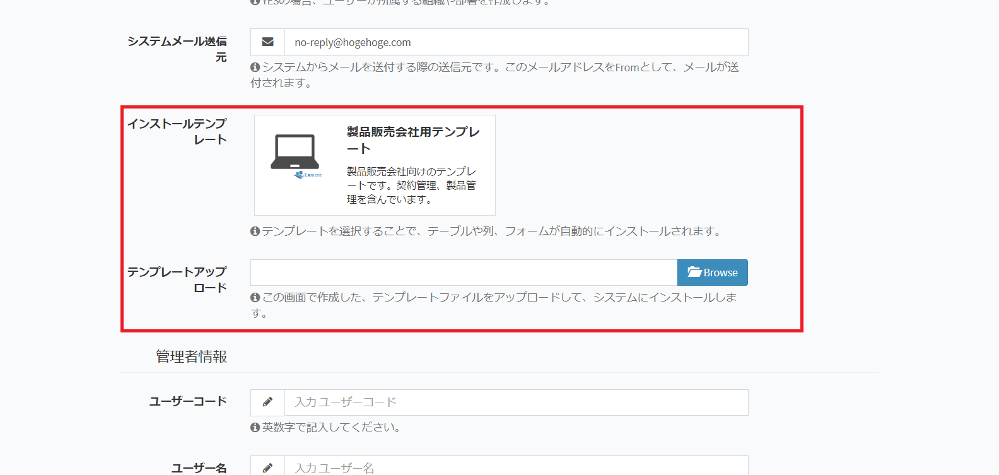

# Install
After setting up the server, it becomes the procedure for installing from the screen.

## URL Access
Access the Exment page.
http(s)://(your site URL)/admin  
* If you want to change the value of "/admin", change the value of "route.prefix" in "config/admin.php".

## Installation screen
If the installation is completed normally, the Exment installation screen will be displayed.  
  
  
Please enter the information necessary for system setup.  

## Template setting
In Exment, templates are prepared in advance.  
By selecting a template, the table, column, form, menu, permission information set in the selected template will be installed.  
You can also upload a template exported with another Exment from this screen.  
For details, please check "template" on the left menu. (The page is currently being created)  
  
  
  
A list of pre-installed templates on the system or templates imported in the past is displayed.  
If you want to install, please select the template you want to add.  

## Installation completed
After entering the necessary information, clicking the "Send" button saves the setting and makes the Exment usable state.