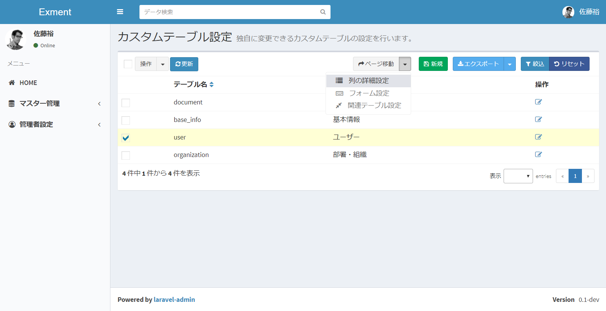
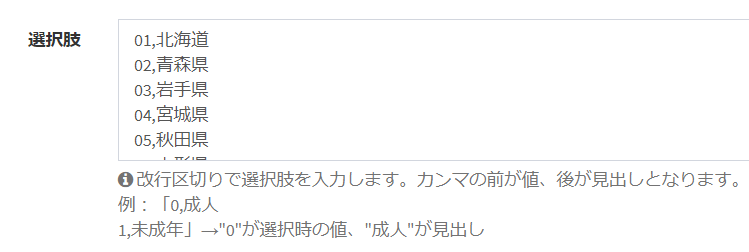

# カスタム列管理
カスタムテーブルが持つ列、「カスタム列」の管理を行います。  

## ページ表示
- カスタムテーブル画面で、変更を行いたいテーブルにチェックを1つ入れ、「ページ移動」の「列の詳細設定」をクリックします。  

- これで、チェックしたカスタムテーブルがもつ、列の一覧を表示します。  

## 列の新規追加
- 「カスタム列詳細設定」画面で、ページ右上の「新規」ボタンをクリックします。

- カスタム列新規追加画面が表示されますので、必要事項を入力します。

## 保存
設定を記入したら、「送信」をクリックしてください。

## 編集
列の編集を行いたい場合、該当する行の「編集」リンクをクリックしてください。  

## 削除
列の削除を行いたい場合、該当する行の「削除」リンクをクリックしてください。  

**※ただし、システムでインストールしている列は削除できません。**

## 記入項目の詳細説明(共通)
- 列種類：設定する列の種類です。この項目で登録した内容が、データ登録時のフォームに適用されます。
    - 1行テキスト：1行テキスト(テキストボックス)です。
    - 複数行テキスト：複数行テキスト(テキストエリア)です。
    - URL：URLです。
    - メールアドレス：メールアドレスです。
    - 整数：整数のみ入力できるフォームです。また、データ登録時のフォームでは、項目の左右に「＋」「－」ボタンが表示され、クリックで値を上下することが出来ます。
    - 小数：小数のみ入力できるフォームです。
    - 日付：日付の項目になります。データ登録時のフォームでは、カレンダーから日付を変更することができます。
    - 時刻：時間の項目になります。データ登録時のフォームでは、時計から時刻を変更することができます。
    - 日付と時刻：日時の項目になります。データ登録時のフォームでは、カレンダーと時計から日時を変更することができます。
    - 選択肢：値と見出しが同じ選択肢一覧になります。
    - 選択肢 (値・見出しを登録)：値と見出しが異なる選択肢一覧になります。
    - 選択肢 (他のテーブルの値一覧から選択)：選択肢が他のテーブルの項目となる、選択肢を作成します。
    - YES/NO：「YES」と「NO」を切り替えるスイッチを作成します。データ登録時、YESだと1、NOだと0と登録されます。
    - 2値の選択：2つの値を切り替えるスイッチを作成します。データ登録時の値も変更できます。
    - 自動採番：UUIDやランダム文字列などを、データ作成時に値を作成します。
    - 画像：画像をアップロードする項目です。
    - ファイル：ファイルをアップロードする項目です。
    - ユーザー：システムのユーザーを選択する選択肢です。
    - 組織：システムの組織を選択する選択肢です。
    - 書類：そのデータに紐付く書類になります。

- 必須：そのフィールドが必須項目であるかどうかを選択します。YESにした場合、データ記入画面で必須項目となり、記入していなかった場合にエラーが表示されます。

- 検索可能：YESにした場合、ページ上部の検索バーで記入した検索ワードの、検索対象となります。各種コードや各種名称など、検索画面で検索させたい列の場合、YESとしてください。  
**また、データの一覧画面で、一覧画面に列として表示されます。**

- プレースホルダー：フォーム項目にプレースホルダーとして登録する文字列です。

- ヘルプ：フォーム項目の下に、情報として表示する内容です。

- ラベルで使用する：YESとした場合、ページ上部の検索ボックスで、このテーブルを選択肢として表示する場合などに、このテーブル項目の見出し（ラベル）として表示させます。  
※同一のテーブル内で、「ラベルで使用する」項目を複数個「YES」とした場合、順序が一番はじめの項目がラベルとして表示されます。

## 記入項目の詳細説明(列種類別)
- 最大文字数(1行テキスト,複数行テキスト)：フォーム項目で記入できる最大文字数です。オーバーした場合にエラーが発生します。

- 最小値(整数、小数)：フォーム項目で記入できる値の最小値です。その値を下回って送信した場合に、エラーが発生します。未記入の場合、最小値のチェックは行いません。

- 最大値(整数、小数)：フォーム項目で記入できる値の最大値です。その値を上回って送信した場合に、エラーが発生します。未記入の場合、最大値のチェックは行いません。

- 選択肢(選択肢, 選択肢 (値・見出しを登録))：フォーム項目で候補として表示する、選択肢を登録します。改行区切りで、複数の候補を登録します。  
列種類で「選択肢 (値・見出しを登録)」を選択していた場合、カンマを列の区切りとして、1列目が値、2列目が見出しになります。

↓  
  
フォームでデータ保存時には、1列目の値がデータベースに保存されます。

- 対象テーブル(選択肢 (他のテーブルの値一覧から選択))：フォーム項目で、選択肢の候補として表示するテーブルを指定します。

- 採番種類（自動採番）：データ登録時に、採番を行う種類を選択します。
    - フォーマット：ユーザーが指定したフォーマットで採番を登録します。
    - ランダム(ライセンスコード)：5文字×5で25文字のランダム文字列を登録します。
    - ランダム(UUID)：合計32桁のランダム文字列を登録します。

- 桁数(自動採番)：自動採番時に、データとして登録する桁数になります。不足分は0埋めで登録します。

- 複数選択を許可する：画像やファイル、選択肢系の項目で、複数の選択肢を行う場合にYESにしてください。

## 自動採番フォーマットのルール
列種類を「自動採番」、採番種類（自動採番）を「フォーマット」にした場合、ユーザー独自のルールで、自動採番を登録することが出来ます。  

| 項目 | 説明 |
| ---- | ---- |
| ${Y} | データ登録時の年が、4桁で設定されます。(例：2018) |
| ${Y:(整数)} | データ登録時の年が、指定した整数の桁数で設定されます。(例：${Y:2}と記入した場合、18) |
| ${M} | データ登録時の月が、2桁で設定されます。(例：08) |
| ${M:(整数)} | データ登録時の月が、指定した整数の桁数で設定されます。(例：${M:2}と記入した場合、8) |
| ${D} | データ登録時の日が、2桁で設定されます。(例：09) |
| ${D:(整数)} | データ登録時の日が、指定した整数の桁数で設定されます。(例：${D:2}と記入した場合、9) |
| ${ID} | データのIDが設定されます。(例：123) |
| ${ID:(整数)} | データのIDが、指定した整数の桁数で設定されます。(例：${ID:5}と記入した場合、00123) |
| ${value:(列名)} | 登録されているデータの列の値が設定されます。(例：ユーザーデータに対し、${value:user_code}と記入した場合、ユーザーコードが設定される) |

#### 例
※実行日が2018/8/9、IDが100、対象のデータのuser_code(ユーザーコード)が"U12345"の場合
- U-${ID:4} → U0100
- ${Y}-${M}-${D}-${ID} → 2018-08-09-100
- ${Y}${M}${D}-${id:5} → 20180809-00100
- ${Y:2}${M}${D}-${id:4} → 180809-0100
- ${Y}${M}${D}-${value:user_code} → 20180809-U12345
