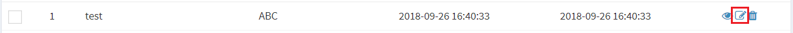
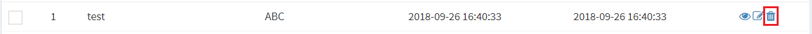

# データ
Exmentに保存している、各テーブルのデータを、一覧・新規追加・編集・表示・削除する機能です。  
システム管理者が作成したテーブルに紐付けて、ユーザーは値を入力して保存します。  
データは主に、以下の機能があります。  

## データ一覧
そのテーブルで保存しているデータの一覧になります。  
一覧に表示されるのは、自分が作成したデータ、または自分が権限を割り当てられているデータになります。  
（※すべてのデータを編集・閲覧する権限を、ユーザーや組織に登録することで、上記の条件に関わらず、すべてのデータが表示されます）  
  
  
一覧画面の詳細は、以下のページをご参照ください。  
[データ一覧](data_grid.md)

## データの新規追加
データの追加を行いたい場合、ページ右上の「新規」ボタンをクリックします。  
※ログインユーザーが、そのテーブルの「編集」権限を所有していない場合、このボタンは表示されません。  
権限の割り当て方法は、左メニューより「権限割り当て」をご参照ください。  

データの新規作成画面が表示されます。

  
新規追加画面の詳細は、以下のページをご参照ください。  
[データフォーム](data_form.md)

## データの編集
データの編集を行いたい場合、該当する行の「編集」リンクをクリックしてください。  
※ログインユーザーが、そのテーブルの「編集」権限を所有していない場合、このリンクは表示されません。  
権限の割り当て方法は、左メニューより「権限割り当て」をご参照ください。  

データの編集画面が表示されます。

  
編集画面の詳細は、以下のページをご参照ください。  
[データフォーム](data_form.md)

## データの表示
データの表示を行いたい場合、該当する行の「表示」リンクをクリックしてください。  

データの表示画面が表示されます。

  
表示画面の詳細は、以下のページをご参照ください。  
[データ表示](data_show.md)

## データの削除
データの削除を行いたい場合、該当する行の「削除」リンクをクリックしてください。  

