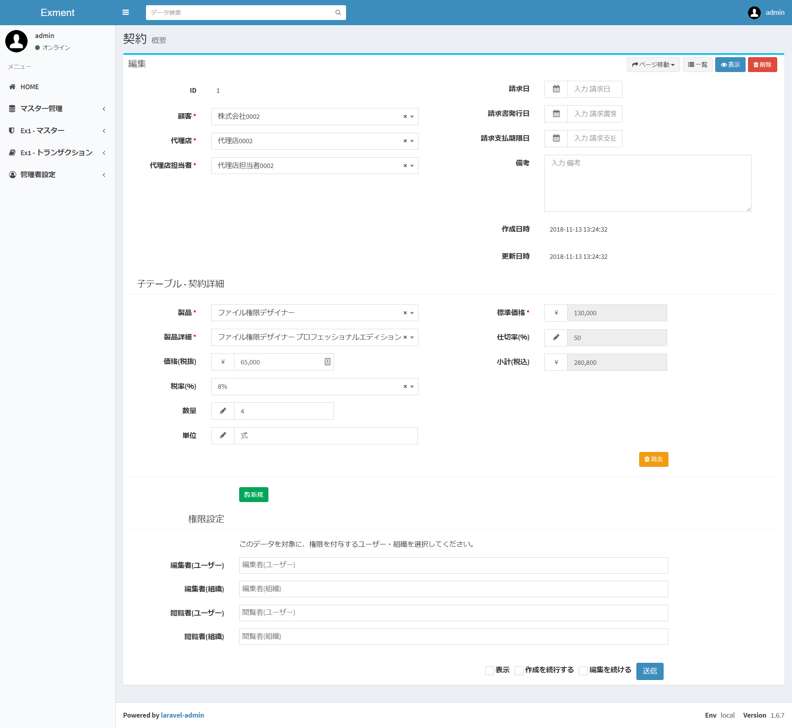
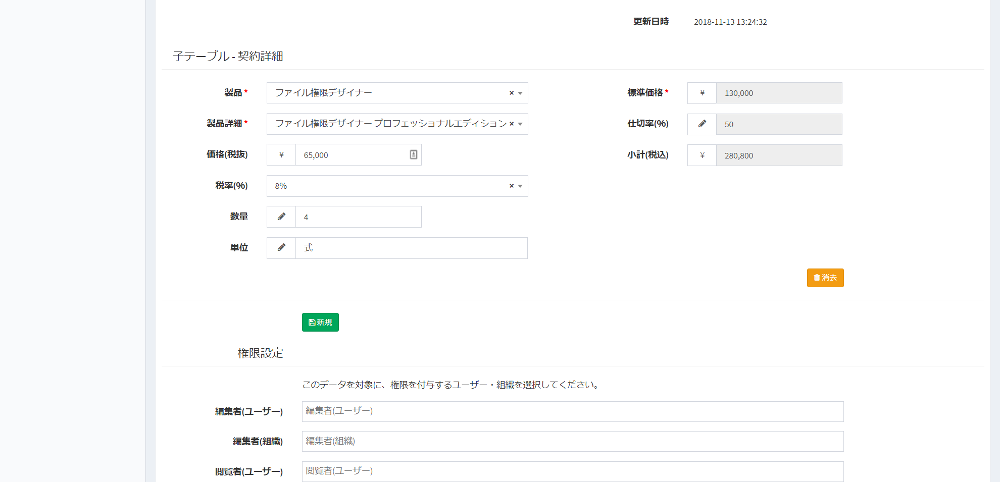

# データフォーム
Exmentにデータを保存するためのフォームを表示します。  
フォーム画面に表示される項目は、[カスタム列設定](/ja/column.md)、カスタムフォーム、[関連テーブル](/ja/relation.md)の設定によって決定します。  
想定通りの表示がされていない場合、上記のページで設定が必要になります。  

## 機能一覧
  

- 「ページ移動」ボタン：  
現在表示しているカスタムテーブルの、設定を変更する画面に切り替えます。

- 「一覧」ボタン：  
データ一覧画面に切り替えます。

- 「表示」ボタン：  
データを閲覧する画面に切り替えます。

- 「削除」ボタン：  
表示しているデータを削除します。※表示しているデータを削除することはできません。

- フォーム項目：  
データの値を変更します。  
フォーム画面に表示される項目は、[カスタム列設定](/ja/column.md)、カスタムフォーム、[関連テーブル](/ja/relation.md)の設定によって決定します。  
想定通りの表示がされていない場合、上記のページで設定が必要になります。  

- 子テーブル：  
[関連テーブル](/ja/relation.md)で、1:nもしくはn:nの設定を行っていた場合、関連テーブルに設定しているテーブルのデータも追加・変更することができます。

## 機能詳細  

### 子テーブル
[関連テーブル](/ja/relation.md)で、1:nもしくはn:nの設定を行っていた場合、関連テーブルに設定しているテーブルのデータも追加・変更することができます。  
例：表示しているテーブル項目が「契約」、子テーブルが「契約明細」の場合、請求日や顧客情報の内容を登録すると同時に、その契約の明細データも追加・変更することができます。  
  
  
※子テーブルデータの表示方法は、「通常フォーム形式」と「テーブル形式」の2種類あります。  
形式の変更は、カスタムフォーム画面で切り替えます。  
  
- 「新規」ボタン：  
子テーブルのデータを1件追加します。  
  
- 「削除ボタン」：  
選択した子テーブルのデータを削除します。  
