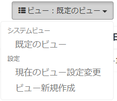

# データ一覧
Exmentに保存している、各テーブルのデータを一覧表示します。  
一覧に表示されるのは、自分が作成したデータ、または自分が権限を割り当てられているデータになります。  
（※すべてのデータを編集・閲覧する権限を、ユーザーや組織に登録することで、上記の条件に関わらず、すべてのデータが表示されます）  

## 機能一覧
  

- 再読込：
一覧を再読込します。

- フィルタ：  
現在表示しているデータ一覧の内容の絞り込みを行います。詳細は下記をご参照ください。

- ビュー：  
現在表示しているカスタムテーブルの、ビューのボタンです。詳細は下記をご参照ください。  

- インポート・エクスポート：  
現在表示しているカスタムテーブルのデータをエクスポート、またはデータをインポートするボタンです。詳細は下記をご参照ください。

- 一覧：  
データ一覧です。  
表示する行項目は、ユーザーの権限、ビューの絞り込み設定、ならびに一覧画面のフィルタ設定によって絞り込まれます。  
表示する列は、ビューの列設定によって変更されます。

## 機能詳細  

### フィルタ
現在表示しているデータ一覧の内容の絞り込みを行います。  
  
絞り込み項目は、「フィルタ」ボタンをクリックすることによって表示されます。  

- 絞り込み可能な項目は、「ID」もしくは、カスタム列設定で、「検索インデックス」をONにしている列です。
[カスタム列設定のマニュアルはこちら](/ja/column.md)

- それぞれの項目で、キーワードを入力し、「サーチ」をクリックすることで、該当する行が絞り込まれて表示されます。  

- フィルタをリセットしたい場合は、「リセット」ボタンをクリックしてください。

- 管理者以外のユーザーが絞り込みを行った場合、ユーザーが権限をもつデータの中から、フィルタ機能による絞り込みが行われます。権限を持たないデータは、フィルタ対象外です。  

- 表示しているビューの絞り込み条件に追加して、フィルタ機能による絞り込みが行われます。

- フィルタ条件の入力は現在、入力による部分一致(中間一致)にのみ対応しております。

### ビュー
現在表示しているカスタムテーブルの、ビューのボタンです。  
ボタン名は、現在表示しているビューの名称が表示されます。  
ボタンをクリックすることで、ビューのメニューが表示れます。
  

- システムビュー：  
システムで登録しているビューの一覧が表示されます。  
項目をクリックすることで、そのビューに表示が切り替わります。

- 設定 - 現在のビュー設定変更：  
現在表示しているビューの設定を変更します。  
項目をクリックすることで、そのビューの設定変更画面に表示が切り替わります。  
※テーブルの管理者権限をもつユーザーのみ、項目が表示されます。  

- 設定 - ビュー新規作成：  
ビューを新規作成します。  
項目をクリックすることで、ビューの新規作成画面に表示が切り替わります。  
※テーブルの管理者権限をもつユーザーのみ、項目が表示されます。  
