# カスタムフォーム
Exmentの[データフォーム画面](/ja/data_form.md)に表示する項目、列の行数、隠しフィールド、データ連動設定を行います。  
このカスタムフォームで設定した内容が、各テーブルの[データフォーム画面](/ja/data_form.md)に反映されます。

## ページ表示
- カスタムテーブル画面で、変更を行いたいテーブルにチェックを1つ入れ、「ページ移動」の「フォーム設定」をクリックします。  
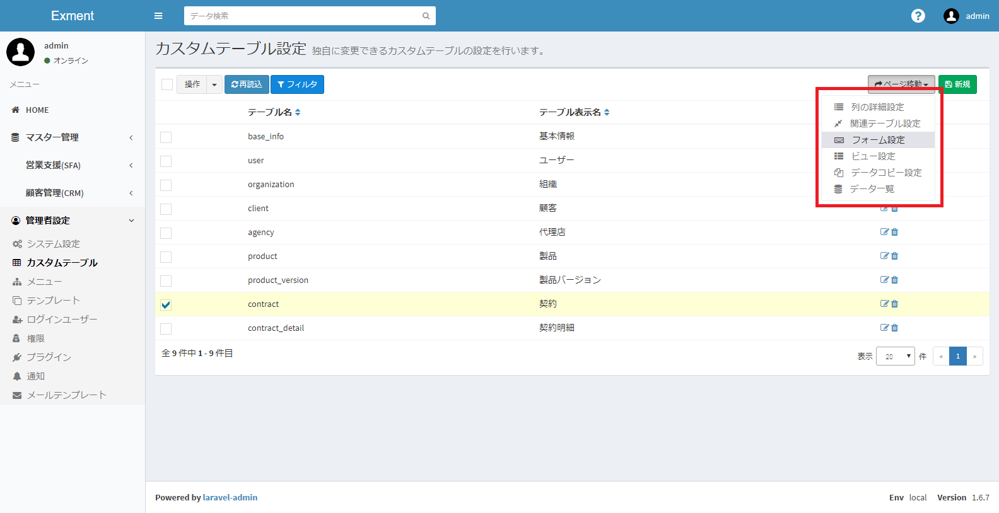

- これで、チェックしたカスタムテーブルがもつ、フォームの一覧を表示します。  
テーブルごとに1つ、既定でフォームが作成されています。
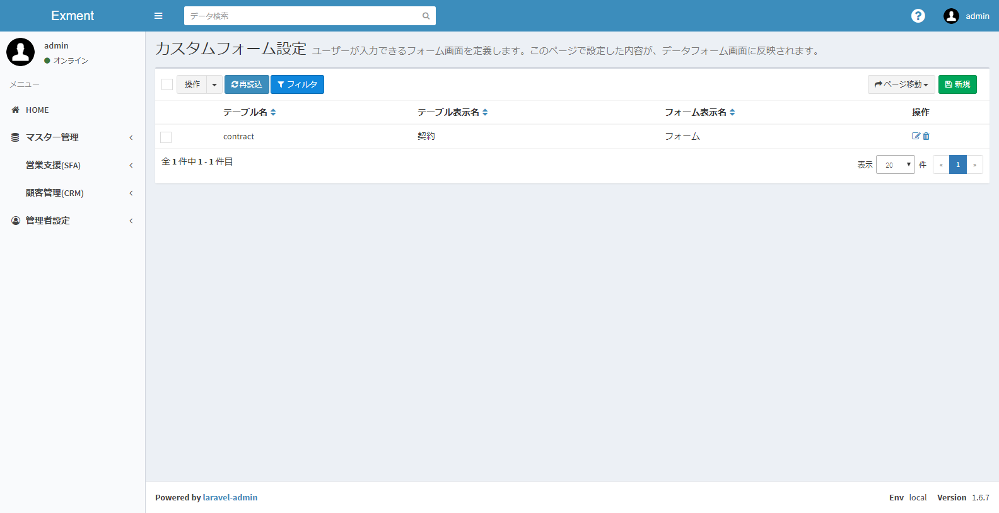

## フォーム編集
フォームの編集を行いたい場合、該当する行の「編集」リンクをクリックしてください。  
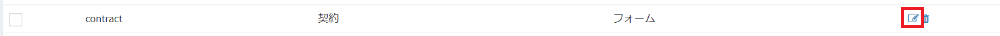

## カスタムフォームの設定項目
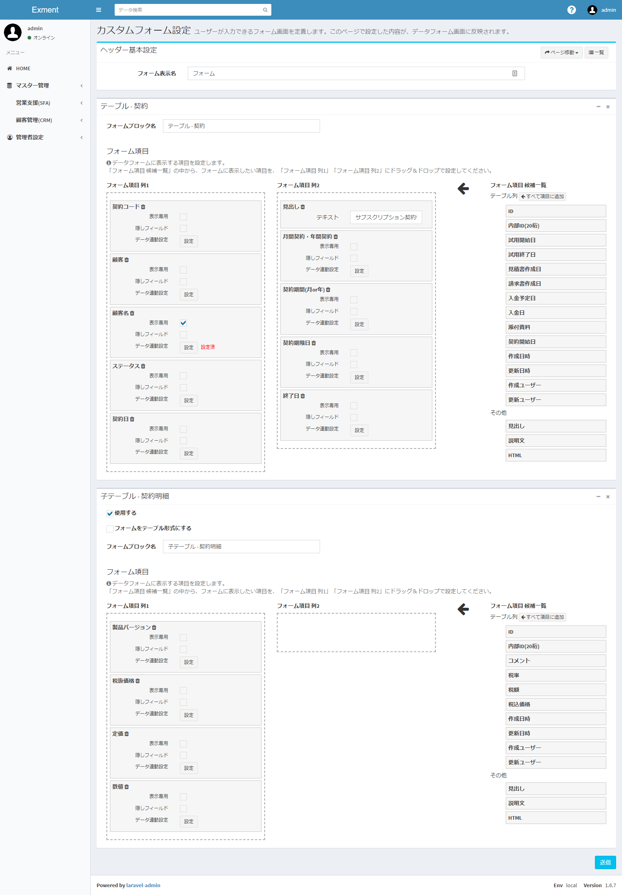

#### フォーム表示名
保存するフォームの名称を記入します。  

#### フォーム項目
入力フォームに表示する項目の設定です。  
設定した列の一覧が、データフォーム画面で表示されます。
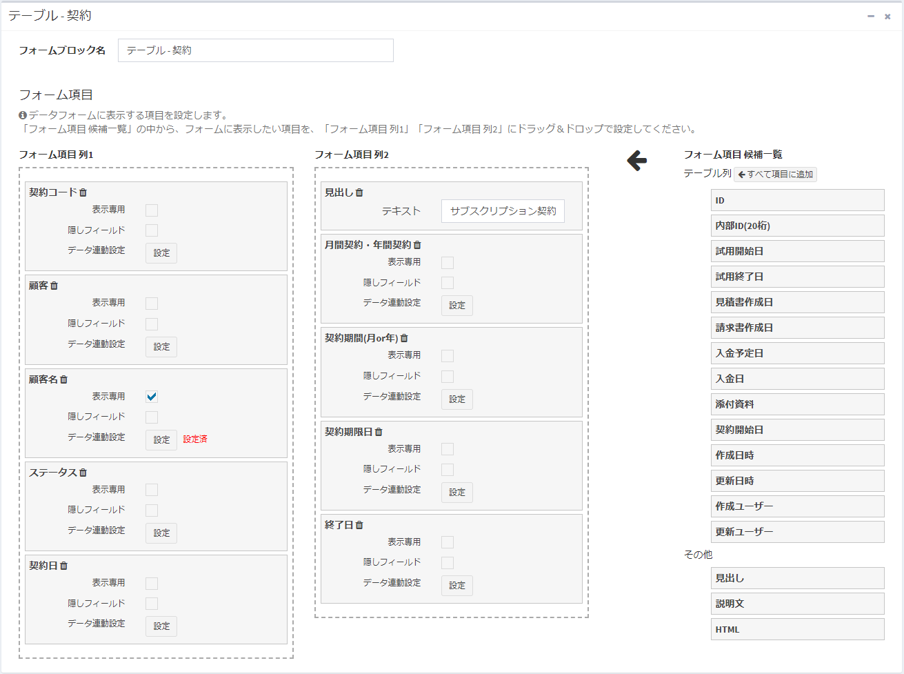

- フォームブロック名：  
フォームの各ブロックに表示する名称です。  
  
- フォーム項目 列1：  
フォームの左列に表示する項目です。  
  
- フォーム項目 列2：  
フォームの右列に表示する項目です。  

- フォーム項目 候補一覧：  
フォームに追加できる項目の候補です。  
種類は「テーブル列」と「その他」の2種類あります。  

- テーブル列：  
追加・編集するデータの、値の項目になります。  
ID、内部ID、作成・更新日時、作成・更新ユーザーを含みます。  
「フォーム項目 列1」もしくは「フォーム項目 列2」に追加することで、データフォームを表示時に、その項目の値を編集、または表示することができます。

- その他：  
フォームに単に表示する、見出しや説明文、HTMLになります。
「フォーム項目 列1」もしくは「フォーム項目 列2」に追加することで、データフォームを表示時に、その項目の値を表示することができます。

#### フォーム項目詳細
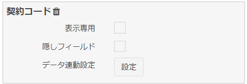
「フォーム項目 列1」もしくは「フォーム項目 列2」に項目を追加した場合、オプションが表示されます。

- 「削除」リンク：  
クリックすることで、フォーム項目一覧から、その項目を削除します。  

- 表示専用：  
チェックを行うと、ユーザーが内容を入力することができず、システムや計算フィールド、データ連動設定（下記）でのみ、値を変更することができます。  

- 隠しフィールド：  
チェックを行うと、項目が画面から表示されず、隠しフィールド(hidden)として追加されます。  
計算フィールドがある場合や、データ連動設定（下記）の場合、フォームに追加することが必要になりますので、隠しフィールドとして設定してください。  

- データ連動設定：  
[データ連動設定](#データ連動設定)を参照してください。  

## データ連動設定
フォーム内の他の項目を選択したときに、選択したデータの値を、項目にコピーすることができます。  
例：「契約」フォーム内の項目「顧客」選択肢を選択時に、「顧客」データ内の「顧客名」項目の値を、「契約」フォーム内の「対象顧客名」項目にコピーするための手順

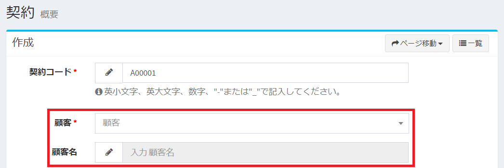
「契約」フォームに「顧客」選択肢と「顧客名」1行テキストがあり、  
  

「顧客」選択時に、  
  
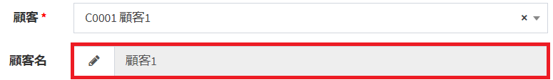
「顧客名」テキストに、値が自動的にセットする  

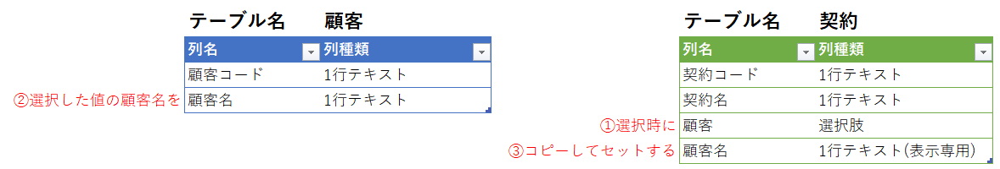
上記のテーブル設定  

##### 手順
- カスタムフォーム画面を開きます。  
フォーム項目の、「顧客名」テキストの「データ連動設定」ボタンをクリックします。  
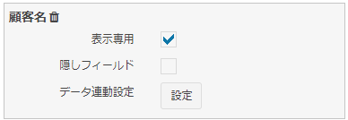

- 「データ連動設定」ダイアログが開きます。  
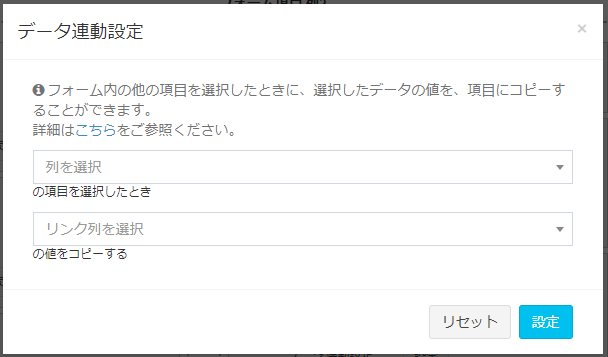

- 1つ目の項目「列を選択」で、変更を行うトリガーとなる列を選択します。  
※この項目の選択肢は、同じフォーム内で、列種類が「選択肢 (他のテーブルの値一覧から選択)」である列の一覧です。  
今回は「顧客」を選択します。  
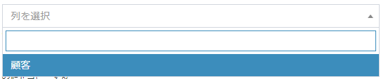

- 「列を選択」項目を選択することで、2つ目の項目「リンク列を選択」の選択肢が表示されます。  
「列を選択」項目で選択したテーブルの、列一覧が表示されます。  
今回は「顧客名」を選択します。  
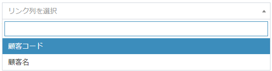

- 設定後、「設定」ボタンをクリックします。  
ダイアログが閉じられ、「データ連動設定」ボタンの隣に「設定済」が表示されます。  
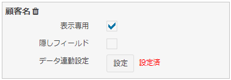

- ページ下部の「送信」ボタンをクリックし、設定を完了してください。