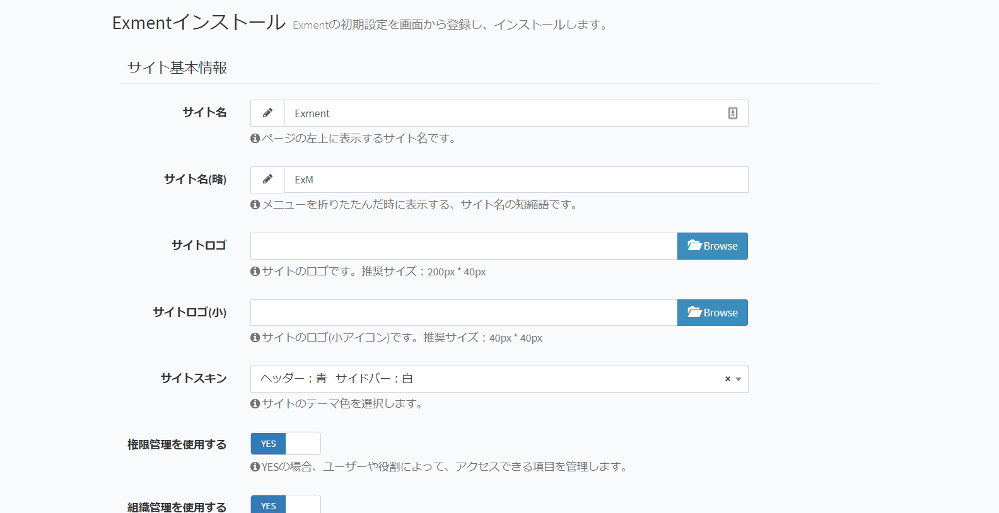

# インストール
サーバー設定後、画面上からインストールを行うための手順になります。

## URLアクセス
Exmentページにアクセスします。  
http(s)://(あなたのサイトURL)/admin  
※"/admin"の値を変更したい場合は、"config/admin.php"の"route.prefix"の値を変更してください。

## インストール画面
正常にインストールが完了している場合、Exmentインストール画面が表示されます。

システムの設定に必要な情報を入力してください。

## テンプレート設定
Exmentでは、あらかじめテンプレートが用意されています。  
テンプレートを選択することで、選択したテンプレートに設定されている、テーブル、列、フォーム、メニュー、権限の情報がインストールされます。  
また、別のExmentでエクスポートしたテンプレートを、この画面からアップロードすることも出来ます。  
詳細は、左メニューの「テンプレート」をご確認ください。（ページは現在作成中）  

システムであらかじめインストールされているテンプレート、もしくは過去にインポートを行ったテンプレートの一覧が表示されています。  
インストールを行いたい場合、追加したいテンプレートを選択してください。  

## インストール完了
必要事項を入力後、「送信」ボタンをクリックすることで、設定が保存され、Exmentが使用可能な状態になります。