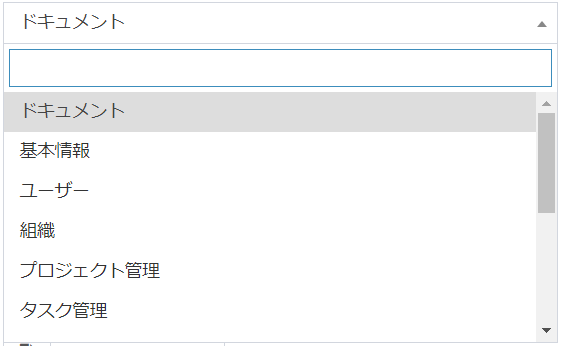
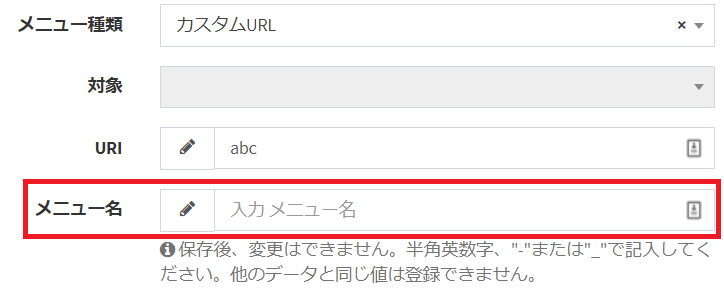

# メニュー
ページ左に表示している、メニューの管理を行います。

## 概要
システムにログイン後、ページにメニューが表示されます。  
このメニューでは、「システムで用意したページ」、「プラグインのページ」、「各テーブルへのページ」、「任意のURL」へ遷移する、メニュー項目を追加できます。  
※ログインしたユーザーが表示できるページのみ、メニュー項目は表示されます。  

## メニュー管理
メニューを管理する方法について記載します。  

### 一覧画面表示
左メニューより、「メニュー」をクリックします。  
もしくは、以下のURLにアクセスしてください。  
これにより、メニュー設定画面が表示されます。
http(s)://(ExmentのURL)/admin/auth/menu  
現在システムで登録されているメニューの一覧が表示されます。

### メニューの新規追加
「メニュー」の一覧画面で、ページ右の「新規」ボックスに、必要事項を入力します。  

#### 親ID
追加するメニューの親となる項目を選択します。最上層にメニューを追加する場合は、「Root」を追加してください。

#### メニュー種類
追加するメニューの種類を選択します。以下の選択肢から選択してください。
- システムメニュー：Exmentで用意しているメニュー項目を追加したい場合に選択します。
- プラグイン：ユーザーがアップロードしたプラグインを、メニューに表示したい場合に選択します。
- テーブルデータ：カスタムテーブルのデータを一覧表示する画面を、メニューに表示したい場合に選択します。
- 親階層：そのメニューの下に、子階層を一覧表示する場合に選択します。
- カスタムURL：任意のURLをメニューに追加する場合に選択します。

#### 対象
追加するメニューの項目を選択します。「メニュー種類」によって、表示される項目が変更されます。
- メニュー種類が「システムメニュー」の場合：Exmentで用意しているページの一覧が表示されます。

- メニュー種類が「プラグイン」の場合：ユーザーがアップロードしたプラグインの一覧が表示されます。
- メニュー種類が「テーブルデータ」の場合：カスタムテーブルの一覧が表示されます。

- メニュー種類が「親階層」「カスタムURL」の場合：選択不可になります。

#### URI
クリックしたときに遷移するURIを入力します。
- メニュー種類が「システムメニュー」「プラグイン」「テーブルデータ」「親階層」の場合：表示のみになり、ユーザーが記入する必要はありません。  

- メニュー種類が「カスタムURL」の場合：クリック時に遷移するURIを記入してください。  
※実際に遷移するページのURLは、以下のようになります。
http(s)://(ExmentのURL)/admin/(記入したURI)

#### メニュー名
メニューの名前を半角英数字で記入します。一意である必要があります。他のメニューとの重複はできません。  
画面には表示されない項目です。  
- メニュー種類が「システムメニュー」「プラグイン」「テーブルデータ」の場合：「対象」を選択時、自動的に記入されます。  
※ただし、同じメニュー項目がすでに登録されている場合、値が重複して保存できないので、値を変更してください。

- メニュー種類が「親階層」「カスタムURL」の場合：他の値と重複しないよう、任意の半角英数字で記入してください。  

#### メニュー表示名
左メニューに表示する名前を記入します。  
※メニュー種類が「システムメニュー」「プラグイン」「テーブルデータ」の場合、「対象」を選択時、自動的に記入されます。  

#### アイコン
左メニューに表示するアイコンを記入します。  
※メニュー種類が「システムメニュー」「プラグイン」「テーブルデータ」の場合、「対象」を選択時、自動的に記入されます。  

### 保存
設定を記入したら、「送信」をクリックしてください。  
※保存後、ブラウザをリフレッシュするか、再度Exmentにアクセスした場合に、左メニューに項目が反映されます。

### 順序並べ替え
すでに保存しているメニュー項目を並べ替える場合、一覧画面で変更できます。  
項目をドラッグ＆ドロップすることで、順番を並べ替えます。  
変更が完了した場合、「保存」をクリックしてください。  

### 編集
メニューの編集を行いたい場合、該当する行の「編集」リンクをクリックしてください。  

### 削除
メニューの削除を行いたい場合、該当する行の「削除」リンクをクリックしてください。  

