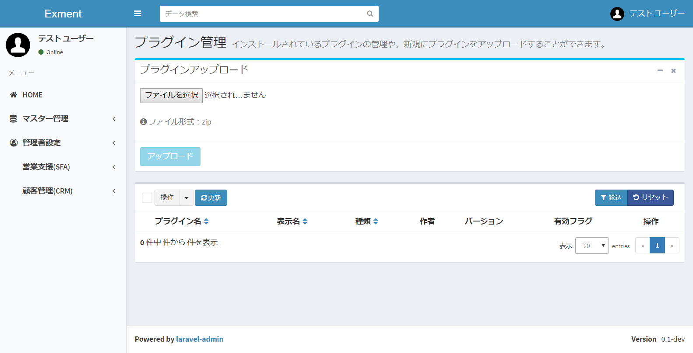
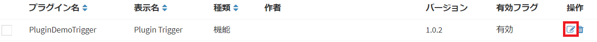
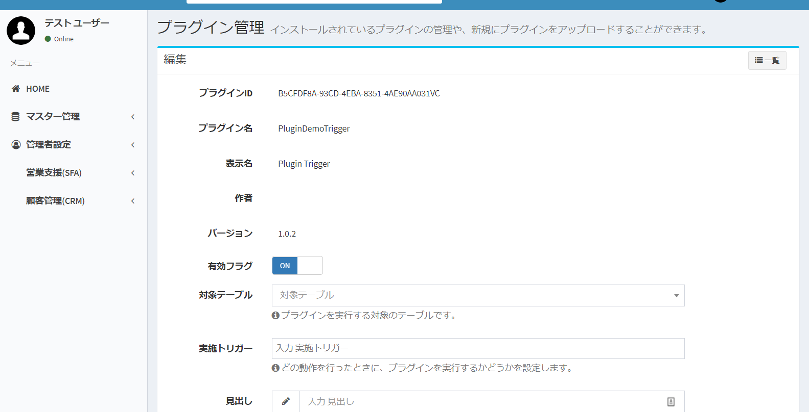
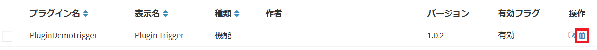

# プラグイン
※2018/09/18現在、β版です。  

## プラグインとは
Exmentでは、「プラグイン」という機能を備えています。  
Exmentが標準で備えている機能が、業務に不足している場合に、その拡張機能として、画面上からプログラムをアップロードすることで、機能を追加することができます。  
プラグインには現在、以下の種類があります。  

#### トリガー
Exmentの画面上で特定の操作を行った場合に実行され、値の更新などの処理を行うことができます。  
もしくは、一覧画面もしくはフォーム画面にボタンを追加し、クリック時に処理を行うことができます。  
特定の操作とは、以下の内容があります。  
- 保存直前：データの保存直前に、処理が起動します。  
- 保存後：データの保存後に、処理が起動します。  
- 一覧画面のメニューボタン：データ一覧画面の上部にボタンを追加し、クリック時にイベントを発生させます。  
- フォームのメニューボタン（新規作成時）：データの新規作成時の上部にボタンを追加し、クリック時にイベントを発生させます。  
- フォームのメニューボタン（更新時）：データの更新時の上部にボタンを追加し、クリック時にイベントを発生させます。  

#### ページ
Exmentに新しい画面を作成することができます。  
既存の機能とは全く異なるページを使用する場合にご利用ください。  

## 管理方法
### ページ表示
- 左メニューより、「プラグイン」を選択します。  
もしくは、以下のURLにアクセスしてください。  
http(s)://(ExmentのURL)/admin/plugin  
これにより、プラグイン画面が表示されます。  
  

### プラグインアップロード
「ファイルを選択」をクリックし、作成したプラグインzipファイルを選択します。
その後、「アップロード」をクリックし、画面からアップロードします。  
  
完了すると、ページ下の一覧にプラグインの情報が表示されます。  

### プラグイン管理
プラグインの有効・無効、プラグインのトリガーや、ページのURIなどの情報を変更します。  
該当する行の「編集」リンクをクリックしてください。  
  

これにより、プラグイン管理ページが表示されます。  
  

### 管理項目

##### 有効フラグ
そのプラグインを、システムで使用するかどうかを切り替えます。  
ONにした場合有効になります。OFFの場合無効になり、システムでは実行されません。  

##### 対象テーブル
プラグインを実行する対象の、カスタムテーブルを指定します。  
設定したテーブルのページを表示した場合に、プラグインが実行されます。  

##### 実施トリガー
どの操作を行った場合に、プラグインを実行するかどうかを設定します。
設定した内容の操作を行った場合に、プラグインが実行されます。  

##### ボタンの見出し
「一覧画面のメニューボタン」もしくは「フォームのメニューボタン」を表示時に、ボタンに表示する見出しを設定します。

##### ボタンのアイコン
「一覧画面のメニューボタン」もしくは「フォームのメニューボタン」を表示時に、ボタンに表示するアイコンを設定します。

##### ボタンのクラス
「一覧画面のメニューボタン」もしくは「フォームのメニューボタン」を表示時に、ボタンのHTMLに付加するclassを設定します。

##### URL(ページの場合のみ)
そのページを表示するためのURLを設定します。

## プラグイン削除
プラグインの削除を行いたい場合には、一覧画面より、該当する行の「削除」リンクをクリックしてください。  
  
※「削除」を実施すると、プラグインのファイルそのものが削除されます。    
プラグインを一時的に無効にしたい場合、「有効フラグ」をNOに設定してください。  

## その他
プラグインの開発方法については、[プラグイン開発方法](/ja/plugin_quickstart.md)をご参照ください。