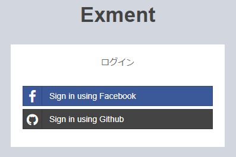
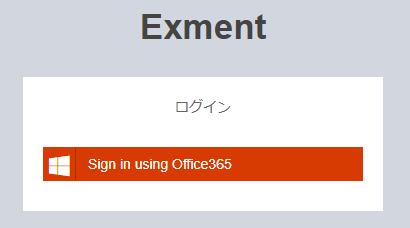

# クイックスタート(追加設定)
[クイックスタート](/ja/quickstart.md)を実施することで、Exmentを実行することができます。  
ですが、一部の機能を使うために、追加で設定が必要になる場合があります。  
以下の機能を使用する場合、手順に従って設定を行ってください。  
- [シングルサインオン](#シングルサインオン)
- [タスクスケジュール](#タスクスケジュール)

  
## シングルサインオン
Exmentでは、シングルサインオン(SSO)が可能です。  
これにより、Exment専用のログインパスワードを管理することなく、各プロバイダのIDとパスワードを使用することができます。  

#### 注意点
- シングルサインオンを使用する場合でも、[ユーザー管理画面](/ja/user.md#ユーザー管理)で、ユーザーをあらかじめ追加する必要があります。  
これは、管理者が意図しないユーザーがExmentにログインし、利用してしまうことを防ぐためです。  
Exmentのユーザーに追加されていない利用者が、各プロバイダのユーザー情報を使用してExmentにログインを行おうとした場合、エラーが発生します。
- Exmentでは、[Socialite](https://github.com/laravel/socialite)でシングルサインオン処理を実装しています。
- このマニュアルでは、OAuthに詳しい方向けの手順になります。Client IDやClient Secretの作成方法などは、各資料をご参照ください。

### 設定手順 
#### 例1 GitHubとFacebookのログインボタンを表示する場合

- 各プロバイダで、Exment用のアプリケーションを作成します。  
※callback URLは以下になります。  
http(s)://(ExmentのURL)/admin/auth/login/(socialiteのprovider名)/callback  
例 GitHubの場合：http(s)://(ExmentのURL)/admin/auth/login/github/callback

- 以下のコマンドを、Exmentのルートディレクトリで実行します。

~~~
composer require laravel/socialite
~~~

- config/services.phpに、各プロバイダのclient_id, client_secretを記入します。  
なお、"redirect"プロパティは自動的に設定されます。

~~~ php

'github' => [
    'client_id'     => 'xxxxxxxxxxxxxxxx',
    'client_secret' => 'yyyyyyyyyyyyyyyy',
],

// このように記載した場合、.envファイルにFB_CLIENT_IDとFB_CLIENT_SECRETを記入してください
'facebook' => [
    'client_id'     => env('FB_CLIENT_ID'),
    'client_secret' => env('FB_CLIENT_SECRET'),
],

~~~

- .envファイルに、以下の内容を追加します。

~~~
EXMENT_LOGIN_PROVIDERS=github,facebook #SSOを使用するプロバイダの一覧をカンマ区切りで記入
EXMENT_SHOW_DEFAULT_LOGIN_PROVIDER=true #通常のログインを表示させるか。SSOを使用する場合はfalse推奨
~~~

- ログイン画面にて、SSOのボタンが表示されます。

#### 例2 Office365のログインボタンを表示する場合
※Office365ログインは、Socialite標準で用意されておりませんので、[Socialite Providers](https://socialiteproviders.github.io/)で非公式プロバイダーを追加します。  
また、非公式プロバイダーにもアバター取得のための処理が含まれていませんので、処理を追加します。(任意)  

- 各プロバイダで、Exment用のアプリケーションを作成します。  
※callback URLは以下になります。  
http(s)://(ExmentのURL)/admin/auth/login/(socialiteのprovider名)/callback  
例 Office365の場合：http(s)://(ExmentのURL)/admin/auth/login/graph/callback

- 以下のコマンドを、Exmentのルートディレクトリで実行します。

~~~
composer require laravel/socialite
composer require socialiteproviders/microsoft-graph
~~~

- config/services.phpに、各プロバイダのclient_id, client_secretを記入します。  
標準では、Office365用のボタンのスタイルが用意されていないので、追加で設定を行います。

~~~ php
'graph' => [
    'client_id'     => 'xxxxxxxxxxxxxxxx',
    'client_secret' => 'yyyyyyyyyyyyyyyy',
    'font_owesome' => 'fa-windows', // アイコン。font-awesomeで指定
    'display_name' => 'Office365', // 画面に表示する文言
    'background_color' => '#D83B01', // 背景色
    'font_color' => '#FFFFFF', // フォント色
    'background_color_hover' => '#ff501e', // オンマウスしたときの背景色
    'font_color_hover' => '#FFFFFF', // オンマウスしたときの文字色
],
~~~

- .envファイルに、以下の内容を追加します。

~~~
EXMENT_LOGIN_PROVIDERS=graph #SSOを使用するプロバイダの一覧をカンマ区切りで記入
EXMENT_SHOW_DEFAULT_LOGIN_PROVIDER=true #通常のログインを表示させるか。SSOを使用する場合はfalse推奨
~~~

- (任意)アバター取得のために、既存のプロバイダーを継承したクラスを、App\Socialiteに作成します。  

~~~ php
////// MicrosoftGraphProvider.php
////// インタフェースProviderAvatarをimplementsし、getAvatarを実装します。  
<?php

namespace App\Socialite;

use Exceedone\Exment\Auth\ProviderAvatar;
use SocialiteProviders\Graph\Provider;

class MicrosoftGraphProvider extends Provider implements ProviderAvatar
{
    /**
     * Get avatar stream
     * @param mixed $token
     * @return string
     */
    public function getAvatar($token = null){
        try
        {
            $client = $this->getHttpClient();
            $response = $client->get('https://graph.microsoft.com/v1.0/me/photo/$value', [
                'headers' => [
                    'Authorization' => 'Bearer '.$token,
                    'Content-Type' => 'application/json;odata.metadata=minimal;odata.streaming=true'
                ],
                'http_errors' => false,
            ]);

            if($response->getStatusCode() == 404){
                return null;
            }

            return $response->getBody()->getContents();

        }
        catch (Exception $exception)
        {
            return null;
        }
        return null;
    }
}

~~~ 

~~~ php
////// GraphExtendSocialite.php
////// 先ほど作成したMicrosoftGraphProviderを指定します  
<?php

namespace App\Socialite;

use SocialiteProviders\Manager\SocialiteWasCalled;

class GraphExtendSocialite
{
    /**
     * Execute the provider.
     */
    public function handle(SocialiteWasCalled $socialiteWasCalled)
    {
        $socialiteWasCalled->extendSocialite(
            'graph', __NAMESPACE__.'\MicrosoftGraphProvider'
        );
    }
}

~~~ 

- App\Providers\EventServiceProvider.phpに、追加したプロバイダを記入します。  

~~~ php
<?php

namespace App\Providers;

use Illuminate\Support\Facades\Event;
use Illuminate\Foundation\Support\Providers\EventServiceProvider as ServiceProvider;

class EventServiceProvider extends ServiceProvider
{
    /**
     * The event listener mappings for the application.
     *
     * @var array
     */
    protected $listen = [
        'App\Events\Event' => [
            'App\Listeners\EventListener',
        ],
        
        /// 追加
        \SocialiteProviders\Manager\SocialiteWasCalled::class => [
            // 'SocialiteProviders\Graph\GraphExtendSocialite@handle', ///// 通常の取得
            '\App\Socialite\GraphExtendSocialite@handle', ///// アバター取得のために継承を行った場合
        ],
    ];

    // ...
}

~~~

- ログイン画面にて、SSOのボタンが表示されます。

  
  

## タスクスケジュール
Exmentでは、タスクスケジュール機能があります。  
具体的には、以下の用途で使用されます。  
- データベースやファイルを、決まった時間に日次バックアップする。  
- あらかじめ設定しておいた通知設定により、特定の条件に合致したデータの関係者に、特定の時刻にメールを送信する。

これらの機能を実行するためには、サーバー側で追加の作業を行う必要があります。  

### 設定手順 
- 以下のコマンドを実行します。

~~~
crontab -e
~~~

- Cronの設定画面が表示されるので、以下の内容を記入します。  
この設定により、artisan scheduleコマンドが毎分実行されます。その後はExmentのシステムにより、決まった時間にタスクが実行されます。  

~~~
* * * * * php /(Exmentのルートディレクトリ)/artisan schedule:run >> /dev/null 2>&1
~~~

