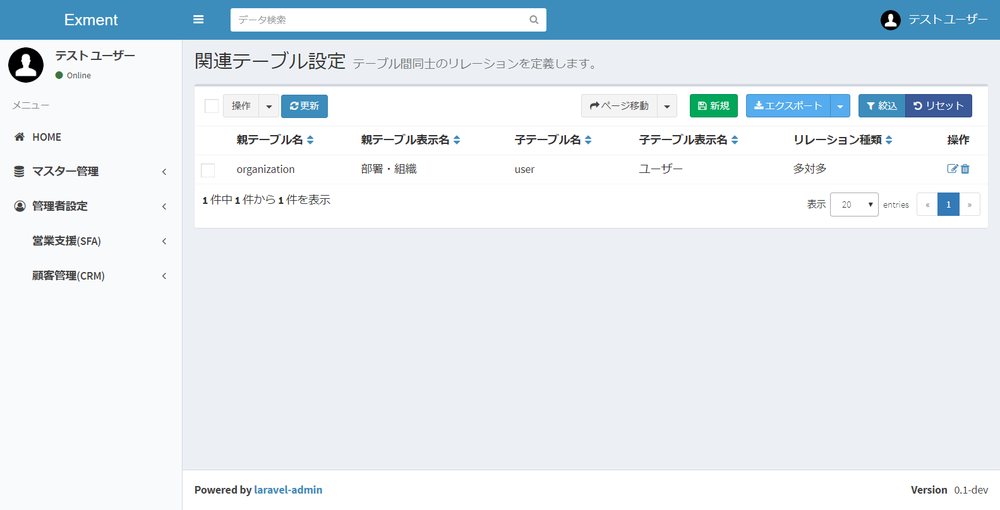
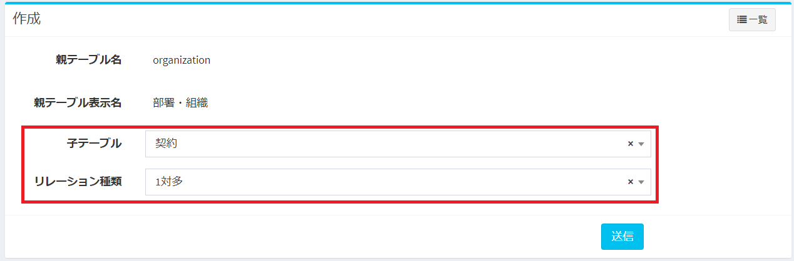
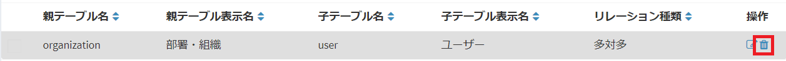

# 関連テーブル
テーブルとテーブルは、関連性をもつ場合があります。  
例：契約とその明細、ユーザーは組織に所属する  
それらのテーブルの関連性を設定します。

## はじめに
Exmentでは、テーブルの関連性を、以下の2つのパターンで定義しています。  
- 1対多：1つの親テーブルのデータに、明細として、子テーブルの複数のデータが紐付く。    
例：契約とその明細  
- 多対多：子テーブルは、1つのテーブル(親テーブル)のデータに、明細として、テーブル(子テーブル)の複数のデータが紐付く  
例：ユーザーは組織に所属する。複数の組織に所属する可能性があるので、多対多で定義  

## ページ表示
- カスタムテーブル画面で、変更を行いたいテーブルにチェックを1つ入れ、「ページ移動」の「関連テーブル設定」をクリックします。  

- これで、チェックしたカスタムテーブルがもつ、関連テーブルの一覧を表示します。  

## 新規追加
- 「関連テーブル設定」画面で、ページ右上の「新規」ボタンをクリックします。

- 関連テーブルの新規追加画面が表示されますので、必要事項を入力します。
  

- 関連付ける子テーブルと、そのリレーションの種類を選択し、「送信」を行ってください。
  

## 編集
列の編集を行いたい場合、該当する行の「編集」リンクをクリックしてください。  
  

## 削除
列の削除を行いたい場合、該当する行の「削除」リンクをクリックしてください。  
  
