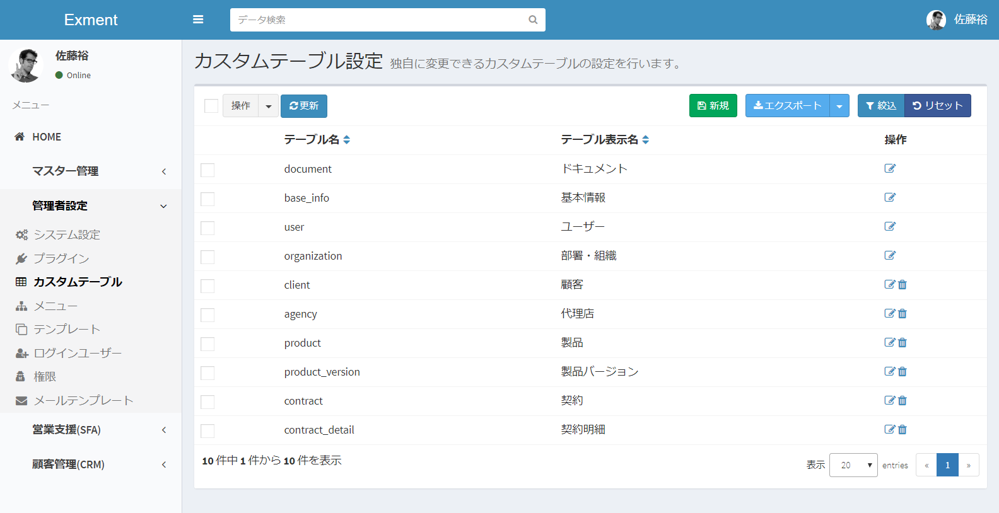

# カスタムテーブル設定
Exmentでは、情報管理を行うためのテーブル「カスタムテーブル」を使用します。  
カスタムテーブルを使用するためには、あらかじめ設定が必要です。
設定方法を記載します。

## 一覧
- 左メニューより、「カスタムテーブル」を選択します。  
もしくは、以下のURLにアクセスしてください。  
http(s)://(ExmentのURL)/admin/table  
これにより、カスタムテーブル設定画面が表示されます。

## 新規追加
カスタムテーブルを新規追加するための手順です。  

- 一覧画面の"新規"ボタンをクリックします。

- テーブル新規追加画面が表示されますので、必要事項を入力します。

## 権限

このテーブルにアクセスできるユーザー、または組織を管理します。  
この設定で保存したユーザー・組織に該当するユーザーのみ、このテーブルにアクセスできます。  
※ただし、メニューの「システム設定」で登録しているユーザー・組織も、このテーブルにアクセスできます。  
  
このテーブルにアクセス許可を行いたいユーザー・組織を、該当する権限の項目に、追加を行ってください。  

## 保存
設定を記入したら、「送信」をクリックしてください。

## 編集
テーブル項目の編集を行いたい場合、該当するカスタムテーブル行の「編集」リンクをクリックしてください。  

## 削除
テーブルの削除を行いたい場合、該当するカスタムテーブル行の「削除」リンクをクリックしてください。  

**※ただし、システムでインストールしているテーブルは削除できません。**