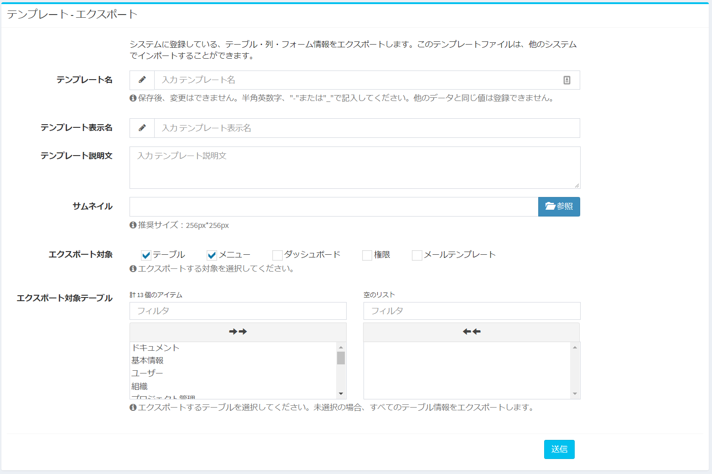
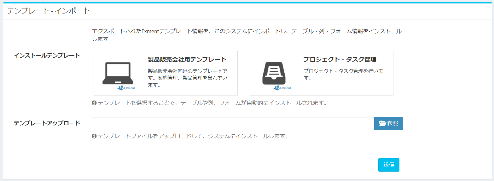

# テンプレート
Exmentのテーブル、列、フォーム情報や、メニュー、ダッシュボードなどの情報を、インポート、またはエクスポートします。  
別のユーザーが作成したテンプレートを、このシステムに取り込むことで、カスタムテーブルなどを作成する手間が省けます。  
また、このシステムで作成したカスタムテーブルなどを、テンプレートとしてエクスポートすることで、他のユーザーが利用することができます。

## ページ表示
- 左メニューより、「テンプレート」を選択します。  
もしくは、以下のURLにアクセスしてください。  
http(s)://(ExmentのURL)/admin/template  
これにより、テンプレート画面が表示されます。  
  

## エクスポート
テンプレートをエクスポートします。  
ページ上項目の「エクスポート」に、必要事項を記入していき、「送信」をクリックすることで、必要情報が記入されたzipファイルが出力されます。  
  

- テンプレート名：
エクスポートしたときに、システムで使用するための名称を、半角英数字、"-"または"_"で記入します。  
他のテンプレートファイルと重複しないような名称を記入してください。  

- テンプレート表示名：
テンプレート画面で表示するテンプレート名を記入します。

- テンプレート説明文：
テンプレート画面で表示する説明文を記入します。

- サムネイル：
テンプレート画面で表示するサムネイルをアップロードします。推奨サイズは256px*256pxです。  
アップロードしない場合、テンプレート画面では「No Image」画像が表示されます。

- エクスポート対象：
このテンプレートでエクスポートする対象を選択します。テンプレートをインポート時、選択した項目が、システムにインポートされます。
  

- エクスポート対象テーブル：
「エクスポート対象テーブル」で、「テーブル」または「メニュー」を選択時、このテーブルで選択したテーブルに関連する内容のみ、エクスポートされます。  
自身が作成したテーブルに関連する内容のみ、エクスポートしてテンプレートを作成したい場合、選択してください。  
※未選択の場合、すべての項目がエクスポートされます。
  

- 保存  
入力が完了したら、「送信」をクリックします。それにより、入力した内容に従って、テンプレートファイルがエクスポートされます。データ形式はzipファイルです。

## インポート
テンプレートをインポートします。  
インポートできるテンプレートは、現在以下の3通りあります。  
- Exmentで用意しているテンプレート
- 画面からアップロードしたテンプレート
- 過去にそのシステムでアップロードしたテンプレート（再度インポートできます）
  

以下のどちらかの方法で、インポートを実行してください。

- インストールテンプレート：
Exmentで用意しているテンプレート、もしくは過去にアップロードしたテンプレートの一覧が表示されています。  
その中から、インポートを行いたいテンプレートを選択してください。

- テンプレートアップロード：
ユーザーがお持ちのExmentテンプレートファイルを、画面からアップロードしてください。  
ファイル形式はzipです。

- 保存  
上記のどちらかを行ったら、「送信」をクリックします。それにより、選択したテンプレート、もしくはアップロードしたテンプレートが、システムにインポートされます。  
それにより、テンプレートで定義しているテーブル・フォーム・ビュー・ダッシュボードなどの情報が、システムにインストールされます。
