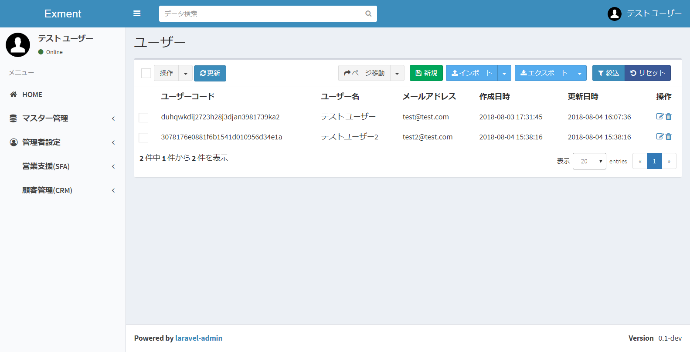
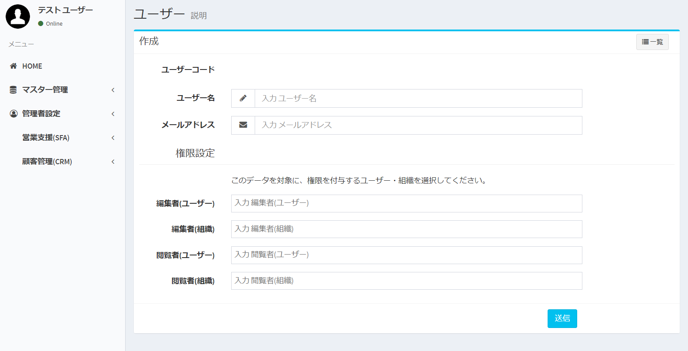
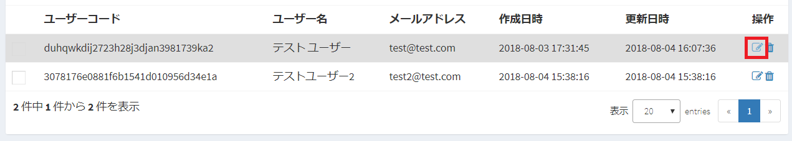
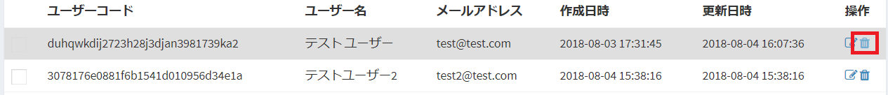
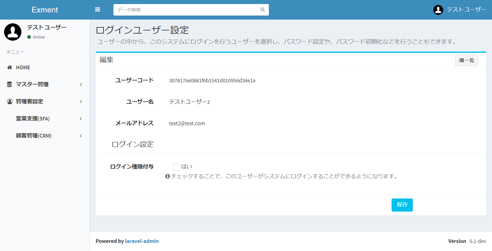
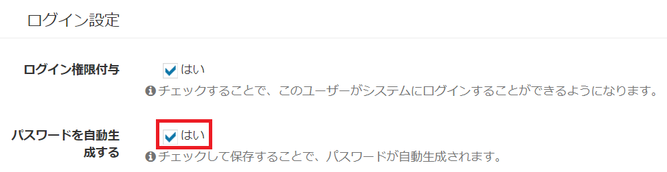
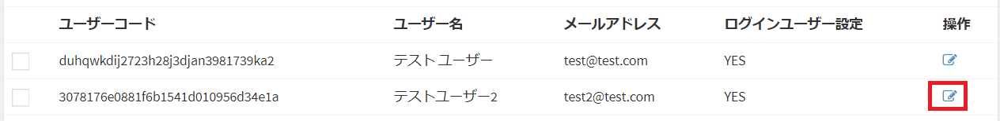
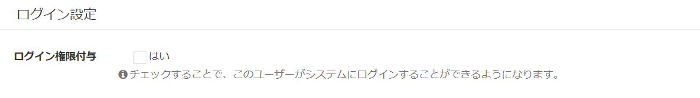

# ユーザー・ログインユーザー
このシステムを使用するユーザー、またはログインユーザーの管理を行います。

## 名称定義
#### ユーザー
自社や組織に所属する社員や、人物です。  
このシステムを使用しない方も、ユーザーとして追加することができます。  
ユーザーコード、Eメールアドレスが必須になります。  
他のテーブルとの関連付けなどで、ユーザーを紐付けて登録することはできますが、システムにログインすることは出来ません。

#### ログインユーザー
ユーザーのうち、このシステムにログインすることができる社員・人物です。  
パスワードが割り振られ、ログイン画面からログインし、データの登録や参照などを行うことが出来るようになります。  

## ユーザー管理
全ユーザー情報を管理する方法について記載します。  

### 一覧画面表示
左メニューより、「ユーザー」をクリックします。  
もしくは、以下のURLにアクセスしてください。  
これにより、ユーザー設定画面が表示されます。
http(s)://(ExmentのURL)/admin/data/user  
現在システムで登録されているユーザーの一覧が表示されます。

### ユーザーの新規追加
- 「ユーザー」画面で、ページ右上の「新規」ボタンをクリックします。

- 新規追加画面が表示されますので、必要事項を入力します。

### 保存
設定を記入したら、「送信」をクリックしてください。

### 編集
ユーザーの編集を行いたい場合、該当する行の「編集」リンクをクリックしてください。  

### 削除
ユーザーの削除を行いたい場合、該当する行の「削除」リンクをクリックしてください。  

## ログインユーザー管理
上記画面で作成したユーザーをもとに、ログインユーザーの管理を行います。  
パスワード情報の追加や、パスワードの再発行、ログイン権限の削除などを行うことができます。  

### 画面表示
左メニューより、「ログインユーザー」をクリックします。  
もしくは、以下のURLにアクセスしてください。  
これにより、ユーザー設定画面が表示されます。
http(s)://(ExmentのURL)/loginuser  
現在システムで登録されているユーザーと、そのログイン情報が表示されます。

### ログイン情報追加
ログイン情報を追加するユーザーの行の、「編集」リンクをクリックしてください。  

ログイン情報編集画面が表示されます。  

ログイン権限を追加する場合、「ログイン権限付与」チェックボックスをクリックします。  

#### パスワード自動生成
ログイン権限を追加時、パスワードを自動生成する場合に、チェックを行います。  
自動生成後、該当するメールアドレスに、パスワードメールが自動送信されます。  

#### パスワード入力
パスワードを自動生成しない場合、チェックを外します。  
その場合、パスワードを入力する項目が表示されます。  
ログインユーザーのパスワードを入力してください。  

### 保存
設定を記入したら、「保存」をクリックしてください。  
ログインユーザーが追加されます。  
※「パスワード自動生成」にチェックを入れていた場合、パスワードメールが自動送信されます。  

## パスワードリセット
パスワードリセットを行います。
一覧画面で、列「ログインユーザー設定」が「YES」のユーザーの、「編集」リンクをクリックしてください。  
  

「パスワードをリセットする」チェックボックスを追加します。  
  
その後、「保存」をクリックしてください。  

## ログインユーザー削除
ログイン権限の削除を行います。  
一覧画面で、列「ログインユーザー設定」が「YES」のユーザーの、「編集」リンクをクリックしてください。  
  

「ログイン権限付与」チェックボックスを解除します。  
  
その後、「保存」をクリックしてください。  

