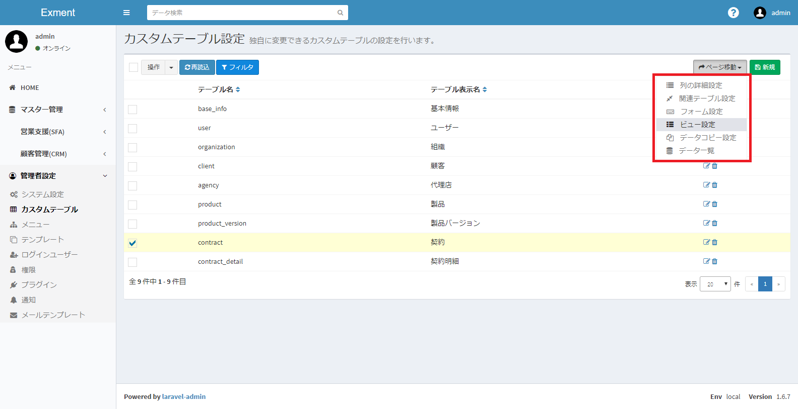
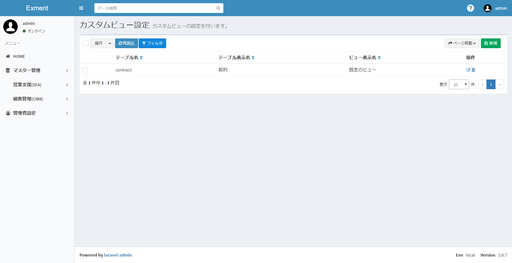
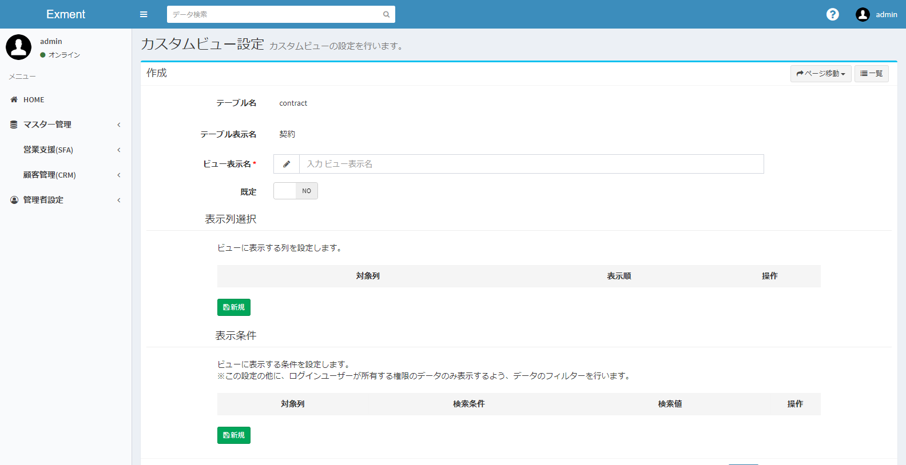
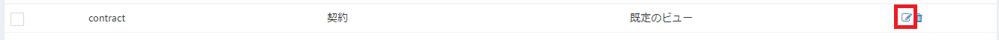
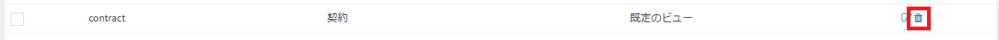
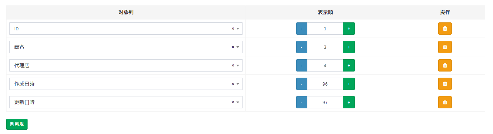
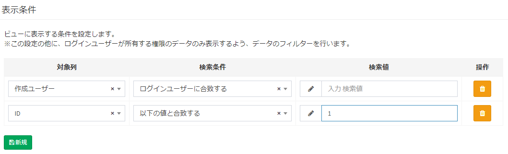
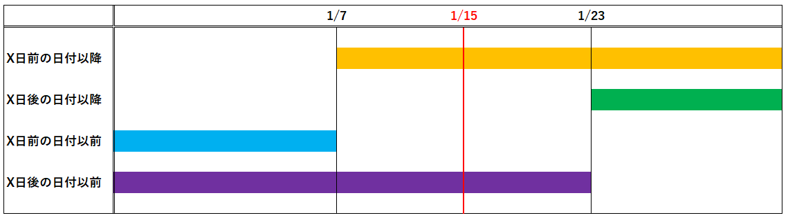

# カスタムビュー
Exmentの[データ一覧画面](data_grid.md)に表示する、列や絞り込みの条件などを設定します。

## ページ表示
- カスタムテーブル画面で、変更を行いたいテーブルにチェックを1つ入れ、「ページ移動」の「ページビュー設定」をクリックします。  

- これで、チェックしたカスタムテーブルがもつ、ビューの一覧を表示します。  

## ビューの新規追加
- 「カスタムビュー設定」画面で、ページ右上の「新規」ボタンをクリックします。

- カスタムビュー新規追加画面が表示されますので、必要事項を入力します。

## 保存
設定を記入したら、「送信」をクリックしてください。

## 編集
ビューの編集を行いたい場合、該当する行の「編集」リンクをクリックしてください。  

## 削除
ビューの削除を行いたい場合、該当する行の「削除」リンクをクリックしてください。  

## カスタムビューの設定項目
#### ビュー表示名
保存するビューの名称を記入します。  

#### 既定
複数のビューを使用する場合で、ユーザーが最初に表示するビューとする場合、YESに設定します。  
※「既定」の項目をYESとできるのは、一つのカスタムテーブル内のビューに1つのみです。  
「既定」を2つ以上のビューでYESとする場合、それ以外の「既定」をNOに変更します。

#### 表示列選択
ビューに表示する列の設定です。  
設定した列の一覧が、データ一覧画面などで表示されます。

- 対象列：  
ビューに表示する列です。  
  
- 表示順：  
ビューに表示する項目の順序です。  
値が小さい順に、左から表示されます。

- 「削除」ボタン：  
ビューの表示を削除します。

- 「新規」ボタン：  
ビューの表示列を新規追加します。

#### 表示条件選択
ビューに表示する条件の設定です。  
期間内の項目のみを表示する、特定のステータスの内容のみを表示するなど、表示内容の絞り込みを行う場合に、条件を追加します。  
※この設定の他に、ログインユーザーが所有する権限のデータのみ表示するよう、データのフィルターを行います。権限のないデータは、この設定に関わらず表示されません。

- 対象列：  
絞り込み条件に使用する列です。  
  
- 検索条件：  
条件の内容を選択します。  
詳細は、ページ下部の「検索条件について」をご確認ください。  
  
- 検索値：  
検索条件の内容に合致するための条件を入力します。  
  
- 「削除」ボタン：  
ビューの表示条件を削除します。
  
- 「新規」ボタン：  
ビューの表示条件を新規追加します。

#### 表示条件選択
ビューに表示する条件の設定です。  
期間内の項目のみを表示する、特定のステータスの内容のみを表示するなど、表示内容の絞り込みを行う場合に、条件を追加します。  
※この設定の他に、ログインユーザーが所有する権限のデータのみ表示するよう、データのフィルターを行います。権限のないデータは、この設定に関わらず表示されません。

- 対象列：  
絞り込み条件に使用する列です。  
  
- 検索条件：  
条件の内容を選択します。  
  
- 検索値：  
検索条件の内容に合致するための条件を入力します。  
  
- 「削除」ボタン：  
ビューの表示条件を削除します。
  
- 「新規」ボタン：  
ビューの表示条件を新規追加します。

#### 検索条件について
「対象列」で選択した内容の種類（「日付」「ユーザー」など）によって、選択肢の項目は変更されます。  
このマニュアル項目では、特記すべき検索条件について記載します。
##### 対象列の種類が「日付」の場合
- X日前の日付以降  
- X日後の日付以降  
- X日前の日付以前  
- X日後の日付以前  
登録しているデータが、該当する範囲の日付で登録されている場合に、ビューに表示されます。  
例：現在日付が1/15で、検索値を「8」で登録している場合  

##### 対象列の種類が「ユーザー」の場合
- ログインユーザーに合致する  
登録しているデータが、ログインユーザーの値と合致する場合に、ビューに表示されます。  
- ログインユーザーに合致しない    
登録しているデータが、ログインユーザーの値と合致しない場合に、ビューに表示されます。  