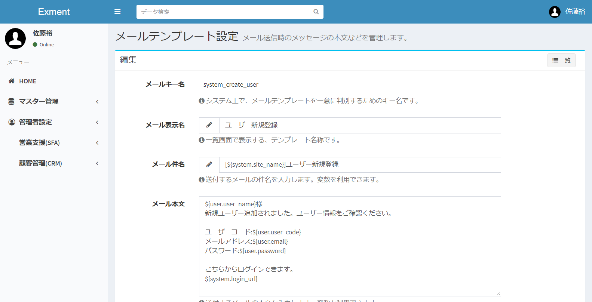

# Mail Template
Set the subject, body, etc. of the mail when sending mail from the system.

## Management method
### Page indication
- From the left menu, select "Mail Template".  
Or please visit the following URL.  
http(s)://(URL of Exment)/admin/mail  
This will display the plug-in screen.  
  

### New template addition
- On the "Mail Template" screen, click the "New" button at the top right of the page.

- The new mail template addition screen will be displayed.

- Enter necessary information.

### Save
After filling in the settings, please click "Save".

### Edit
If you want to edit the template, please click "Edit" link in the corresponding line.

### Delete
If you want to delete a column, please click the "Delete" link in the corresponding line.
  
**  * However, you can not delete templates installed on the system.  **

## Rule of variables
Variables can be used for "mail subject" and "mail body".  
By using variables, you can add registered data, system name, etc. to the subject / body.

### Variable list
#### general purpose

| Item | Description |
| ---- | ---- |
| ${system.site_name} | system site name |
| ${system.site_name_short} | system site name (shortened) |
| ${system.system_mail_from} | system source |
| ${system.system_url} | system home URL |
| ${system.login_url} | system login URL |
| ${user.user_name} | user name of the user to whom the mail is sent |
| ${user.user_code} | user's user code of the mail recipient |
| ${user.email} | E-mail address of e-mail recipient user |

#### Password reset
It can be used only when sending mail of password reset.

| Item | Description |
| ---- | ---- |
| ${system.password_reset_url} | System password reset URL |
| ${user.password} | login password of mail sending user |