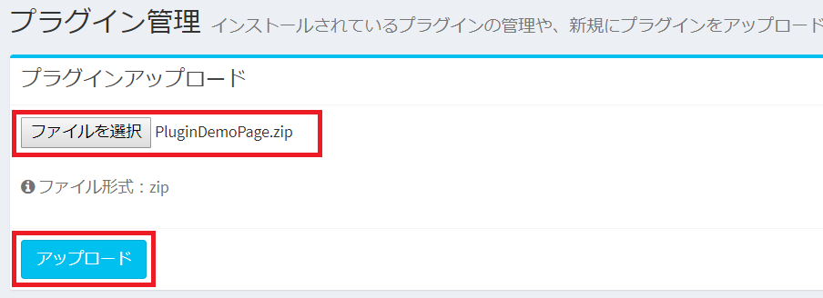

# Plugin
*As of 2018/09/18, it is beta version.

## What is the Plugin?
Exment has the function of "Plugin".  
If the functions provided by Exment as standard are short for business, you can add the function by uploading the program from the screen as its extended function.  
There are currently the following types of Plugins.

#### Trigger
It is executed when a specific operation is performed on the screen of Exment and processing such as updating the value can be performed.  
Alternatively, you can add buttons to the list screen or form screen and process them when clicking.  
The specific operation has the following contents.
- Just before saving: Processing starts immediately before saving data.
- After saving: Processing starts after data is saved.
- Menu button on the list screen: Add a button to the top of the data list screen and generate an event when clicking.
- Form menu button (when newly created): Add a button at the top of data creation, and generate an event when clicking.
- Form menu button (when updating): Add a button at the top of data update and generate an event when clicked.

#### Page
You can create a new screen for Exment.  
Please use it when using a page completely different from the existing function.  

## Management method
### Page indication
- From the left menu, select "Plugin".  
Or please visit the following URL.  
http(s)://(URL of Exment)/admin/plugin  
This will display the plugin screen.  

### Plugin Upload
Click "Select file" and select the plugin zip file you created.  
Then click "Upload" and upload from the screen.  
  
When complete, plugin information is displayed in the list at the bottom of the page.

### Plugin management
Change information such as valid / invalid of plugin, trigger of plugin, page URI, etc.  
Please click "Edit" link of the corresponding line.  
  
  
This will bring up the plugin administration page.  
  
  
### Control item

##### Valid flag
I will switch whether or not to use that plugin on the system.  
It becomes effective when it is turned ON. When it is OFF, it becomes invalid and it will not be executed on the system.  

##### Target table
Specify a custom table to execute the plugin.  
The plugin is executed when displaying the page of the set table.

##### Implementation trigger
When you perform an operation, set whether or not to execute plugin.  
The plugin is executed when you perform the operation of the set contents.  

##### Button heading
When displaying "Menu button of list screen" or "Menu button of form", set the heading to be displayed on the button.

##### Button icon
When displaying "Menu button of list screen" or "Menu button of form", set the icon to be displayed on the button.

##### Button class
When displaying "Menu button of list screen" or "Menu button of form", set the class to be added to the HTML of the button.

##### URL (for pages only)
Set the URL for displaying the page.

## Plugin removed
If you want to delete the plugin, from the list screen please click the "delete" link on the corresponding line.  
  
* When you execute "Delete", the plugin file itself is deleted.  
To temporarily disable the plugin, set "valid flag" to NO.  

## Other
Please refer to [Plugin development method](plugin_quickstart.md) about how to develop plugin.