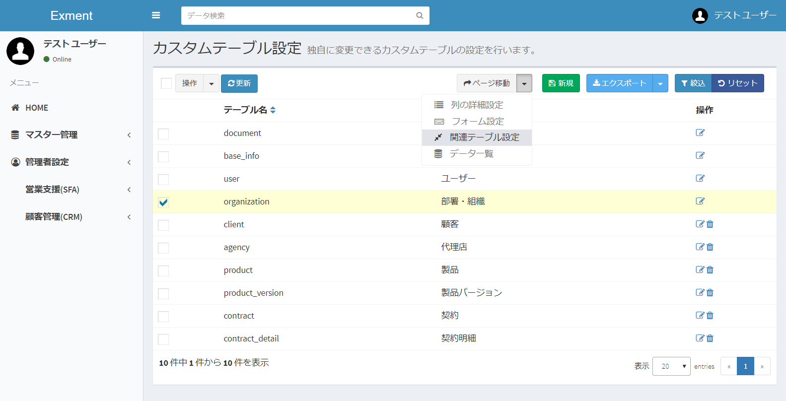
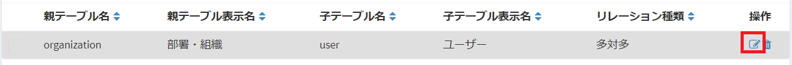

# Custom Relation Table
Tables and tables may have relevance.  
Example: contract and its statement, user belongs to organization  
Set the relevance of those tables.  

## Introduction
In Exment, the relation of the table is defined by the following two patterns.
- One to many: Multiple data of the child table are linked as data to the data of one parent table.  
Example: Contract and its details  
- Many-to-many: In a child table, data of one table (parent table) is linked to data of a table (child table) as details.  
Example: A user belongs to an organization. Since there is a possibility of belonging to multiple organizations, many-to-many definition

## Display page
- On the custom table screen, put a check in the table you want to change and click "Related table setting" in "Move page".  

- This will display the list of related tables that the checked custom table has.  

## Add new
- On the "Related table setting" screen, click the "New" button at the top right of the page.

- The new addition screen of the related table will be displayed, enter necessary information.  

- Select the child table to associate with and the type of relation, and "send".  

## Edit
If you want to edit a column, please click the "Edit" link in the corresponding line.  

## Delete
If you want to delete a column, please click the "Delete" link in the corresponding line.  
