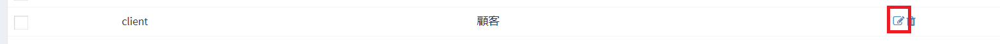
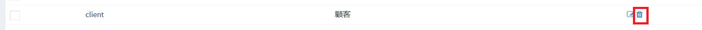

# Custom Table Setting
In Exment, we use the table "custom table" for information management.  
In order to use a custom table, it is necessary to set it beforehand.  
It describes the setting method.

## List
- From the left menu, select "Custom table".  
Or please visit the following URL.  
http(s)://(URL of Exment)/admin/table  
This displays the custom table setting screen.    

## Add new
This is the procedure for adding a new custom table.

- Click the "New" button on the list screen.

- New table screen will be displayed, enter necessary information.  

## Role
  
Manage users or organizations that can access this table.  
Only users who correspond to users/organizations saved under this setting can access this table.  
However, users and organizations registered in "System setting" of the menu can also access this table.  
  
Please add users/organizations you want to grant access to this table to the corresponding role item.

## Save
After filling in the settings, please click "Send".

## Edit
If you want to edit table fields, please click the "Edit" link in the corresponding custom table row.

## Delete
If you want to delete a table, please click the "delete" link in the corresponding custom table row.

**  * However, tables installed on the system can not be deleted.  **