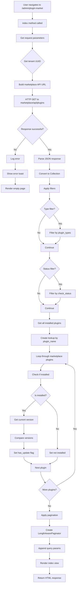
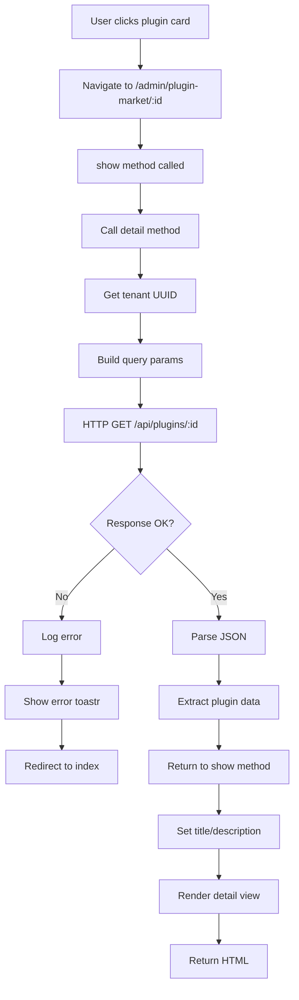
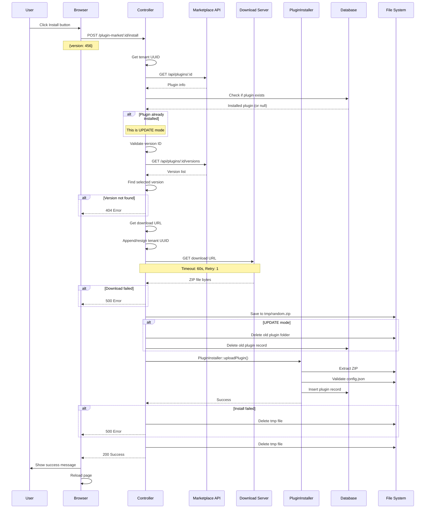
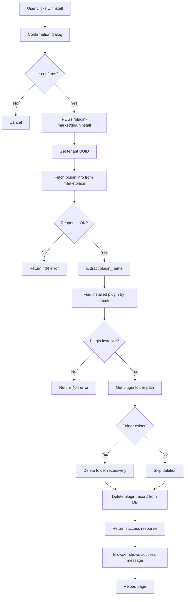

# PluginMarketController - Business Logic Flows

## Controller Overview

**File**: `src/Controllers/PluginMarketController.php` (795 dòng)

**Extends**: `AdminController` (Laravel Admin base controller)

**Purpose**: Xử lý toàn bộ nghiệp vụ Plugin Marketplace - browse, detail, install, update, uninstall plugins

**Key Responsibilities**:
- Fetch plugin data từ external marketplace API
- Enrich marketplace data với local installation status
- Handle plugin installation/update/uninstall
- Manage download URLs và tenant authentication
- Error handling và user notifications

## Controller Methods Overview

```php
class PluginMarketController extends AdminController
{
    // Display marketplace plugin list
    public function index(Content $content)
    
    // Display single plugin detail
    public function show($id, Content $content)
    public function detail($id)
    
    // Plugin actions
    public function install(Request $request, $id)
    public function uninstall(Request $request, $id)
    
    // Session management
    public function clearAutoInstall(Request $request)
    
    // Helper methods
    protected function form()
    protected function getRepoUrl(): string
    protected function getMarketplaceUrl(): string
    protected function getMarketplaceBaseUrl(): string
    protected function getTenantUuid(): ?string
    protected function appendTenantUuidToUrl(string $url, ?string $uuid): string
    protected function resignMarketplaceSignedUrl(string $url, ?string $uuid, int $minutes): string
}
```

## Method 1: index() - Browse Marketplace

### Purpose
Hiển thị danh sách tất cả plugins từ marketplace, cho phép filter và search.

### Flow Diagram



### Code Flow

```php
public function index(Content $content)
{
    try {
        // Step 1: Get filter parameters
        $request = request();
        $type = $request->input('type');      // e.g., "page", "dashboard"
        $status = $request->input('status');  // e.g., "approved", "pending"
        $search = $request->input('search');  // keyword search
        
        // Step 2: Get tenant UUID for license info
        $tenantUuid = $this->getTenantUuid();
        $queryParams = [];
        if (!empty($tenantUuid)) {
            $queryParams['tenant_uuid'] = $tenantUuid;
        }
        
        // Step 3: Fetch from marketplace API
        $response = Http::withoutVerifying()
            ->timeout(30)
            ->connectTimeout(10)
            ->get($this->getRepoUrl(), $queryParams);
        
        if ($response->failed()) {
            throw new \Exception('Marketplace API request failed');
        }
        
        // Step 4: Parse and filter
        $plugins = collect($response->json());
        
        // Filter by type (plugin_types field contains comma-separated types)
        if ($type) {
            $plugins = $plugins->filter(function ($plugin) use ($type) {
                $pluginTypes = $plugin['plugin_types'] ?? '';
                return str_contains(strtolower($pluginTypes), strtolower($type));
            });
        }
        
        // Filter by status (check_status field)
        if ($status) {
            $plugins = $plugins->filter(function ($plugin) use ($status) {
                $checkStatus = strtolower($plugin['check_status'] ?? '');
                return $checkStatus === strtolower($status);
            });
        }
        
        $plugins = $plugins->values()->all();
        
        // Step 5: Enrich with local installation info
        try {
            $installed = Plugin::all()->keyBy(function ($p) {
                return strtolower($p->plugin_name ?? '');
            });
            
            foreach ($plugins as $i => $p) {
                $nameKey = strtolower($p['plugin_name'] ?? '');
                $isInstalled = $installed->has($nameKey) && !empty($nameKey);
                
                $plugins[$i]['is_installed'] = $isInstalled;
                
                if ($isInstalled) {
                    $installedVersion = $installed->get($nameKey)->version ?? null;
                    $plugins[$i]['current_version'] = $installedVersion;
                    
                    // Version comparison using PHP's version_compare
                    $plugins[$i]['has_update'] = $installedVersion && isset($p['version'])
                        ? version_compare($installedVersion, $p['version'], '<')
                        : false;
                } else {
                    $plugins[$i]['current_version'] = null;
                    $plugins[$i]['has_update'] = false;
                }
            }
        } catch (\Throwable $e) {
            Log::warning('[PluginMarket] Failed to enrich plugin data: ' . $e->getMessage());
        }
        
        // Step 6: Paginate
        $perPage = (int) $request->input('per_page', 20);
        $perPage = min(max($perPage, 1), 200);  // Between 1 and 200
        
        $page = (int) $request->input('page', 1);
        $page = max($page, 1);
        
        $total = count($plugins);
        $items = array_slice($plugins, ($page - 1) * $perPage, $perPage);
        
        $plugins = new LengthAwarePaginator($items, $total, $perPage, $page, [
            'path' => $request->url(),
            'pageName' => 'page',
        ]);
        $plugins->appends($request->except('page'));
        
        // Step 7: Render view
        return $content->title(exmtrans('plugin.market.title'))
            ->description(exmtrans('plugin.market.description'))
            ->body(view('exment::plugin.market.index', compact('plugins', 'tenantUuid')));
            
    } catch (\Throwable $e) {
        Log::error('[PluginMarket] Exception: ' . $e->getMessage());
        admin_toastr(exmtrans('plugin.market.message.connection_error'), 'error');
        
        $plugins = [];
        $tenantUuid = $this->getTenantUuid();
        return $content->title(exmtrans('plugin.market.title'))
            ->description(exmtrans('plugin.market.description'))
            ->body(view('exment::plugin.market.index', compact('plugins', 'tenantUuid')));
    }
}
```

### Key Business Rules

1. **Tenant UUID Propagation**: Nếu có tenant UUID, LUÔN gửi trong query params để lấy license info
2. **Case-Insensitive Matching**: Plugin name matching dùng `strtolower()` để tránh case mismatch
3. **Version Comparison**: Dùng `version_compare($installed, $marketplace, '<')` - returns true nếu có update
4. **Pagination Bounds**: Min 1, max 200 per page
5. **Silent Enrichment**: Nếu enrichment fail, log warning nhưng vẫn hiển thị marketplace data
6. **Graceful Degradation**: Nếu API fail, show empty page với error message (không crash)

### Error Handling Scenarios

| Scenario | Handling | User Impact |
|----------|----------|-------------|
| Marketplace API down | Catch exception, show toastr error, render empty page | Sees error message, empty plugin list |
| Invalid JSON response | Exception caught, logged | Same as above |
| Enrichment fails | Try-catch around enrichment, log warning | Plugins shown without install status |
| Network timeout | HTTP client throws exception, caught in outer try | Shows connection error |

### Performance Considerations

- **HTTP Timeout**: 30s total, 10s connect - balance between reliability và UX
- **Pagination**: Slice array in memory - marketplace returns full list (consider API-side pagination)
- **N+1 Query**: Avoided by loading ALL installed plugins in 1 query, then keyBy
- **Memory**: Full plugin list loaded to memory - OK for small/medium marketplaces (<1000 plugins)

## Method 2: show() & detail() - Plugin Detail

### Purpose
Hiển thị chi tiết đầy đủ của 1 plugin, bao gồm description, screenshots, versions, requirements.

### Flow Diagram



### Code Flow

```php
public function show($id, Content $content)
{
    // Wrapper method to set proper title/description
    $detail = $this->detail($id);
    
    // Handle redirect responses
    if ($detail instanceof \Illuminate\Http\RedirectResponse) {
        return $detail;
    }
    
    return $content->title(exmtrans('plugin.market.detail.title'))
        ->description(exmtrans('plugin.market.description'))
        ->body($detail);
}

public function detail($id)
{
    try {
        $request = request();
        $tenantUuid = $this->getTenantUuid();
        $queryParams = [];
        if (!empty($tenantUuid)) {
            $queryParams['tenant_uuid'] = $tenantUuid;
        }
        
        // Fetch single plugin detail
        $response = Http::withoutVerifying()
            ->timeout(30)
            ->connectTimeout(10)
            ->get("{$this->getRepoUrl()}/{$id}", $queryParams);
        
        if ($response->failed()) {
            admin_toastr(exmtrans('plugin.market.plugin_not_found'), 'error');
            return redirect(admin_url('plugin-market'));
        }
        
        $plugin = $response->json();
        
        // Return view (not Content object)
        return view('exment::plugin.market.detail', compact('plugin'));
        
    } catch (\Illuminate\Http\Client\ConnectionException $e) {
        Log::error("[PluginMarket] Connection error: " . $e->getMessage());
        admin_toastr(exmtrans('plugin.market.message.connection_error'), 'error');
        return redirect(admin_url('plugin-market'));
    } catch (\Throwable $e) {
        Log::error('[PluginMarket] Detail exception: ' . $e->getMessage());
        admin_toastr(exmtrans('plugin.market.message.connection_error'), 'error');
        return redirect(admin_url('plugin-market'));
    }
}
```

### Key Business Rules

1. **Single Plugin Fetch**: GET `/api/plugins/{id}` với tenant UUID
2. **License Info Included**: Marketplace returns `has_license`, `expires_at` nếu có tenant UUID
3. **404 Handling**: Redirect về index với error message
4. **Connection Error**: Log error, redirect về index
5. **View vs Content**: `detail()` returns View, `show()` wraps in Content object

### Response Data Structure

```php
[
    'id' => 123,
    'uuid' => '550e8400-e29b-41d4-a716-446655440000',
    'plugin_name' => 'AdvancedDataGrid',
    'plugin_view_name' => 'Advanced Data Grid',
    'plugin_types' => 'Page,Dashboard',
    'version' => '2.1.0',
    'description' => 'Short description',
    'long_description' => '## Full markdown description...',
    'screenshots' => ['url1', 'url2'],
    'author' => 'ExceedOne',
    'url' => 'https://...',
    'documentation_url' => 'https://...',
    'is_free' => false,
    'price' => 99.00,
    'currency' => 'USD',
    
    // License info (if tenant_uuid provided)
    'has_license' => true,
    'expires_at' => '2026-12-31T23:59:59Z',
    'is_expired' => false,
    
    // Versions
    'versions' => [
        [
            'id' => 456,
            'version' => '2.1.0',
            'is_latest' => true,
            'release_date' => '2026-02-01',
            'changelog' => '...',
            'download_url' => 'https://...'
        ]
    ]
]
```

## Method 3: install() - Install Plugin

### Purpose
Download và install plugin từ marketplace vào hệ thống local.

### Complete Flow Diagram



### Detailed Code Flow

```php
public function install(Request $request, $id)
{
    try {
        // ========== STEP 1: Extract Parameters ==========
        $versionId = $request->input('version');  // Required
        $tenantUuid = $this->getTenantUuid();
        $queryParams = [];
        if (!empty($tenantUuid)) {
            $queryParams['tenant_uuid'] = $tenantUuid;
        }
        
        Log::info("[PluginMarket] Install request", [
            'plugin_id' => $id,
            'version_id' => $versionId,
            'tenant_uuid' => $tenantUuid,
            'marketplace_url' => $this->getMarketplaceUrl(),
        ]);
        
        // ========== STEP 2: Get Plugin Info ==========
        $pluginResponse = Http::withoutVerifying()
            ->timeout(30)
            ->connectTimeout(10)
            ->get("{$this->getRepoUrl()}/{$id}", $queryParams);
        
        if ($pluginResponse->failed()) {
            return response()->json([
                'error' => exmtrans('plugin.market.message.plugin_not_found')
            ], 404);
        }
        
        $pluginData = $pluginResponse->json();
        $pluginName = $pluginData['plugin_name'] ?? null;
        
        // ========== STEP 3: Check Existing Installation ==========
        $isUpdate = false;
        $installedPlugin = null;
        if ($pluginName) {
            $installedPlugin = Plugin::where('plugin_name', $pluginName)->first();
            if ($installedPlugin) {
                $isUpdate = true;
                Log::info("[PluginMarket] This is an update", [
                    'current_version' => $installedPlugin->version,
                ]);
            }
        }
        
        // ========== STEP 4: Validate Version ==========
        if (empty($versionId)) {
            return response()->json([
                'error' => exmtrans('plugin.market.message.please_select_version')
            ], 400);
        }
        
        // ========== STEP 5: Get Version Info ==========
        $versionResponse = Http::withoutVerifying()
            ->timeout(30)
            ->connectTimeout(10)
            ->get("{$this->getRepoUrl()}/{$id}/versions", $queryParams);
        
        if ($versionResponse->failed()) {
            if (!empty($tenantUuid) && $versionResponse->status() === 404) {
                return response()->json([
                    'error' => exmtrans('plugin.market.message.plugin_not_found')
                ], 404);
            }
            return response()->json([
                'error' => exmtrans('plugin.market.message.version_load_failed')
            ], 400);
        }
        
        $versionsData = $versionResponse->json();
        $selectedVersion = collect($versionsData['versions'] ?? [])
            ->firstWhere('id', (int)$versionId);
        
        if (!$selectedVersion) {
            return response()->json([
                'error' => exmtrans('plugin.market.message.version_not_found')
            ], 404);
        }
        
        // ========== STEP 6: Prepare Download URL ==========
        Log::info("[PluginMarket] Installing plugin version", [
            'version_id' => $versionId,
            'version' => $selectedVersion['version'] ?? 'UNKNOWN',
        ]);
        
        if (empty($selectedVersion['download_url'])) {
            return response()->json([
                'error' => exmtrans('plugin.market.message.no_download_url')
            ], 400);
        }
        
        $downloadUrl = $selectedVersion['download_url'];
        
        // Option A: Resign signed URL (for S3 pre-signed URLs)
        if ((bool) config('exment.market_resign_signed_download_url', false)) {
            $downloadUrl = $this->resignMarketplaceSignedUrl(
                $downloadUrl, 
                $tenantUuid, 
                10  // 10 minutes validity
            );
        }
        // Option B: Simple append tenant UUID
        else {
            $downloadUrl = $this->appendTenantUuidToUrl($downloadUrl, $tenantUuid);
        }
        
        Log::info("[PluginMarket] Downloading plugin", [
            'download_url' => $downloadUrl,
        ]);
        
        // ========== STEP 7: Download Plugin ZIP ==========
        try {
            $zipResp = Http::withoutVerifying()
                ->timeout(60)           // Longer timeout for large files
                ->connectTimeout(10)
                ->retry(1, 200)         // Retry once, wait 200ms
                ->get($downloadUrl);
        } catch (\Throwable $downloadError) {
            Log::warning('[PluginMarket] Download exception', [
                'plugin_id' => $id,
                'version_id' => $versionId,
                'message' => $downloadError->getMessage(),
            ]);
            
            return response()->json([
                'error' => exmtrans('plugin.market.message.download_failed')
            ], 500);
        }
        
        // ========== STEP 8: Validate Download Response ==========
        if ($zipResp->failed()) {
            $contentType = $zipResp->header('Content-Type');
            $bodyPreview = null;
            
            try {
                if (is_string($contentType) && str_contains(strtolower($contentType), 'application/json')) {
                    $bodyPreview = $zipResp->json();
                } else {
                    $body = $zipResp->body();
                    if (!is_string($body)) {
                        $body = '';
                    }
                    $bodyPreview = substr($body, 0, 2000);
                    // Remove non-printable chars
                    $bodyPreview = preg_replace('/[^\x09\x0A\x0D\x20-\x7E]/', '.', $bodyPreview);
                    $bodyPreview = Str::limit($bodyPreview, 2000);
                }
            } catch (\Throwable $previewError) {
                $bodyPreview = '<<unable to read response body: ' . $previewError->getMessage() . '>>';
            }
            
            Log::warning('[PluginMarket] Download failed', [
                'plugin_id' => $id,
                'version_id' => $versionId,
                'status' => $zipResp->status(),
                'content_type' => $contentType,
                'body_preview' => $bodyPreview,
            ]);
            
            return response()->json([
                'error' => exmtrans('plugin.market.message.download_failed')
            ], 500);
        }
        
        $zipBytes = $zipResp->body();
        
        // ========== STEP 9: Save to Temporary Location ==========
        $tmpPath = 'tmp/' . Str::random(10) . '.zip';
        Storage::disk('local')->put($tmpPath, $zipBytes);
        $fullPath = Storage::disk('local')->path($tmpPath);
        
        // ========== STEP 10: Install Plugin ==========
        try {
            // If update mode, remove old version first
            if ($isUpdate && $installedPlugin) {
                Log::info("[PluginMarket] Removing old version before update", [
                    'old_version' => $installedPlugin->version,
                ]);
                
                // Delete plugin folder
                $disk = Storage::disk(Define::DISKNAME_ADMIN);
                $folder = $installedPlugin->getPath();
                if ($disk->exists($folder)) {
                    $disk->deleteDirectory($folder);
                }
                
                // Delete database record
                $installedPlugin->delete();
            }
            
            // Install new version
            PluginInstaller::uploadPlugin(new \Illuminate\Http\File($fullPath));
            
            // Clean up temporary file
            Storage::disk('local')->delete($tmpPath);
            
            $message = $isUpdate 
                ? exmtrans('plugin.market.message.update_success') 
                : exmtrans('plugin.market.message.install_success', ['name' => $pluginName ?? '']);
            
            return response()->json([
                'success' => true, 
                'message' => $message
            ]);
            
        } catch (\Throwable $installError) {
            // Clean up temporary file
            Storage::disk('local')->delete($tmpPath);
            
            Log::error("[PluginMarket] Installation failed: " . $installError->getMessage(), [
                'plugin_id' => $id,
                'version_id' => $versionId,
            ]);
            
            return response()->json([
                'error' => exmtrans('plugin.market.message.install_failed') . ': ' . $installError->getMessage()
            ], 500);
        }
        
    } catch (\Throwable $e) {
        Log::error("[PluginMarket] Error installing plugin $id: " . $e->getMessage());
        return response()->json([
            'error' => exmtrans('plugin.market.message.install_error') . ': ' . $e->getMessage()
        ], 500);
    }
}
```

### Key Business Rules

1. **Version Required**: Phải chọn version, không dùng "latest" tự động
2. **Update Detection**: Nếu `plugin_name` exists trong DB → UPDATE mode
3. **Atomic Update**: Xóa old version TRƯỚC khi install new (không rollback nếu install fail)
4. **Download Timeout**: 60s (vs 30s cho API calls) - large files need more time
5. **Retry Logic**: Retry 1 lần nếu download fail (transient errors)
6. **Temp File Cleanup**: ALWAYS delete temp file (success hoặc failure)
7. **Tenant UUID Propagation**: Cần thiết cho paid plugins để verify license

### State Transitions

```
NOT_INSTALLED --[install()]--> INSTALLING --[success]--> INSTALLED
                               |
                               +--[error]--> NOT_INSTALLED (rollback)

INSTALLED --[install(same)]----> INSTALLING --[success]--> INSTALLED
          |                      |
          |                      +--[error]--> REMOVED (old deleted)
          |
          +--[install(update)]-> REMOVING --> INSTALLING --[success]--> INSTALLED (new version)
                                              |
                                              +--[error]--> REMOVED (old deleted, new failed)
```

### Error Response Codes

| HTTP Code | Scenario | Business Meaning |
|-----------|----------|------------------|
| 400 Bad Request | Missing version, invalid data | Client error - fix request |
| 404 Not Found | Plugin/version not found | Resource doesn't exist |
| 500 Internal Error | Download failed, install failed | Server error - retry may help |

### Installation vs Update Logic

| Aspect | Install (new) | Update (existing) |
|--------|---------------|-------------------|
| Check existing | Plugin not in DB | Plugin exists in DB |
| Pre-action | None | Delete old folder + DB record |
| Install action | PluginInstaller::uploadPlugin() | Same |
| Rollback on error | Delete temp file only | Old deleted, new failed (no rollback) |
| Success message | "installed successfully" | "updated successfully" |

### Security & Validation

1. **Version ID Validation**: Must exist in versions array
2. **Download URL Validation**: Must not be empty
3. **ZIP Validation**: Body preview logged if download fails
4. **Tenant Authentication**: Marketplace validates tenant has access
5. **File System Safety**: Random temp filename prevents collisions

## Method 4: uninstall() - Remove Plugin

### Purpose
Xóa hoàn toàn plugin khỏi hệ thống (files + database).

### Flow Diagram



### Code Flow

```php
public function uninstall(Request $request, $id)
{
    try {
        // ========== STEP 1: Get Tenant UUID ==========
        $tenantUuid = $this->getTenantUuid();
        $queryParams = [];
        if (!empty($tenantUuid)) {
            $queryParams['tenant_uuid'] = $tenantUuid;
        }
        
        // ========== STEP 2: Get Plugin Info from Marketplace ==========
        // Why? We need plugin_name to find installed plugin
        $pluginResponse = Http::withoutVerifying()
            ->timeout(30)
            ->connectTimeout(10)
            ->get("{$this->getRepoUrl()}/{$id}", $queryParams);
        
        if ($pluginResponse->failed()) {
            return response()->json([
                'error' => exmtrans('plugin.market.message.plugin_not_found')
            ], 404);
        }
        
        $pluginData = $pluginResponse->json();
        $pluginName = $pluginData['plugin_name'] ?? null;
        
        if (!$pluginName) {
            return response()->json([
                'error' => exmtrans('plugin.market.message.invalid_plugin_data')
            ], 400);
        }
        
        // ========== STEP 3: Find Installed Plugin ==========
        $installedPlugin = Plugin::where('plugin_name', $pluginName)->first();
        
        if (!$installedPlugin) {
            return response()->json([
                'error' => exmtrans('plugin.market.message.plugin_not_installed')
            ], 404);
        }
        
        $pluginId = $installedPlugin->id;
        
        // ========== STEP 4: Delete Plugin Folder ==========
        $disk = Storage::disk(Define::DISKNAME_ADMIN);  // e.g., "admin" disk
        $folder = $installedPlugin->getPath();  // e.g., "plugins/PluginName/"
        
        if ($disk->exists($folder)) {
            $disk->deleteDirectory($folder);
        }
        
        // ========== STEP 5: Delete Database Record ==========
        $installedPlugin->delete();
        
        // ========== STEP 6: Return Success ==========
        return response()->json([
            'result' => true,
            'status' => true,
            'swal' => exmtrans('plugin.market.message.uninstall_success', ['name' => $pluginName])
        ]);
        
    } catch (\Throwable $e) {
        Log::error("[PluginMarket] Error uninstalling plugin $id: " . $e->getMessage());
        return response()->json([
            'error' => exmtrans('plugin.market.message.uninstall_error') . ': ' . $e->getMessage()
        ], 500);
    }
}
```

### Key Business Rules

1. **Marketplace Lookup First**: Phải get plugin_name từ marketplace (không dùng ID trực tiếp)
2. **Plugin Name Matching**: Match by `plugin_name` (case-sensitive in WHERE clause)
3. **Folder Deletion**: Delete entire plugin directory recursively
4. **No Rollback**: Deletion is permanent, không có rollback mechanism
5. **Success Response Format**: Special format với `result`, `status`, `swal` keys

### Why Fetch from Marketplace?

```php
// Why not just: Plugin::find($id)->delete() ?
// Answer: $id is MARKETPLACE id, not local DB id

// Marketplace ID vs Local DB ID:
// - Marketplace: id = 123 (marketplace plugin ID)
// - Local DB: id = 5 (auto-increment primary key)
// - Link: plugin_name (unique identifier)

// Flow:
// 1. Marketplace ID → plugin_name
// 2. plugin_name → Local plugin record
// 3. Delete local plugin
```

### Business Risks

| Risk | Impact | Mitigation |
|------|--------|------------|
| Marketplace down | Cannot uninstall | Show error, allow force uninstall via admin panel |
| Plugin in use | Data inconsistency | Should check plugin_type dependencies before delete |
| Partial deletion | Folder exists but DB record deleted | Add cleanup job to remove orphaned folders |
| Concurrent uninstall | Race condition | Add database locks or queue-based processing |

### Response Format

```json
{
  "result": true,
  "status": true,
  "swal": "Plugin 'AdvancedDataGrid' has been uninstalled successfully."
}
```

**Note**: Format khác với install (chỉ có `success` và `message`). Frontend expects `swal` key.

## Method 5: clearAutoInstall() - Session Management

### Purpose
Xóa session data liên quan đến auto-install flow (không được implement trong commit này).

### Code

```php
public function clearAutoInstall(Request $request)
{
    session()->forget('plugin_auto_install');
    return response()->json(['success' => true]);
}
```

### Use Case (Future Feature)

Khi user click "Install" từ external link:
1. External site redirects: `exment.com/plugin-market?auto_install=PluginName`
2. Controller lưu `plugin_auto_install` vào session
3. Sau khi install xong, clear session

## Helper Methods

### getTenantUuid()

```php
protected function getTenantUuid(): ?string
{
    $tenantUuid = config('exment.market_tenant_uuid');
    if (is_string($tenantUuid) && trim($tenantUuid) !== '') {
        return trim($tenantUuid);
    }
    return null;
}
```

**Business Logic**:
- Read from config (environment variable)
- Trim whitespace
- Return null if empty (OSS mode)

**Usage**: EVERY marketplace API call phải include tenant UUID (if exists)

### getRepoUrl()

```php
protected function getRepoUrl(): string
{
    return rtrim(config('exment.market_plugin_url', 'https://exment.org'), '/') . '/api/plugins';
}
```

**Returns**: `https://exment.org/api/plugins`

### appendTenantUuidToUrl()

```php
protected function appendTenantUuidToUrl(string $url, ?string $tenantUuid): string
{
    if (empty($tenantUuid)) {
        return $url;
    }
    
    $separator = str_contains($url, '?') ? '&' : '?';
    return $url . $separator . 'tenant_uuid=' . urlencode($tenantUuid);
}
```

**Example**:
```php
appendTenantUuidToUrl('https://example.com/download', '123-456')
// Returns: https://example.com/download?tenant_uuid=123-456

appendTenantUuidToUrl('https://example.com/download?v=1', '123-456')
// Returns: https://example.com/download?v=1&tenant_uuid=123-456
```

### resignMarketplaceSignedUrl()

```php
protected function resignMarketplaceSignedUrl(string $url, ?string $tenantUuid, int $validityMinutes = 10): string
{
    // Parse original URL
    $parts = parse_url($url);
    $basePath = $parts['scheme'] . '://' . $parts['host'] . ($parts['path'] ?? '');
    
    // Generate new signature
    $expires = time() + ($validityMinutes * 60);
    $stringToSign = $basePath . '|' . $tenantUuid . '|' . $expires;
    $signature = hash_hmac('sha256', $stringToSign, config('app.key'));
    
    // Build new URL
    $newUrl = $basePath 
        . '?tenant_uuid=' . urlencode($tenantUuid ?? '')
        . '&expires=' . $expires
        . '&signature=' . $signature;
    
    return $newUrl;
}
```

**Purpose**: Re-sign S3 pre-signed URLs để extend expiry time

**Use Case**:
- Original S3 signed URL: expires in 5 minutes
- Download large plugin: takes 10 minutes
- Solution: Resign URL với 10 minutes validity

**Security**: Uses `APP_KEY` để sign → marketplace phải verify với cùng key

## Cross-Cutting Concerns

### Logging Strategy

```php
// Info logs - normal operations
Log::info("[PluginMarket] Install request", [...]);
Log::info("[PluginMarket] This is an update", [...]);
Log::info("[PluginMarket] Installing plugin version", [...]);
Log::info("[PluginMarket] Downloading plugin", [...]);

// Warning logs - recoverable errors
Log::warning('[PluginMarket] Download exception', [...]);
Log::warning('[PluginMarket] Download failed', [...]);
Log::warning('[PluginMarket] Failed to enrich plugin data', [...]);

// Error logs - critical failures
Log::error('[PluginMarket] Exception: ' . $e->getMessage());
Log::error("[PluginMarket] Installation failed: " . $e->getMessage());
Log::error("[PluginMarket] Error installing plugin $id: " . $e->getMessage());
```

**Prefix**: `[PluginMarket]` để dễ grep logs

### Exception Handling Patterns

#### Pattern 1: Try-Catch with Graceful Degradation

```php
try {
    // Enrich with local installation info
    $installed = Plugin::all()->keyBy(...);
    foreach ($plugins as $i => $p) {
        // ...enrichment logic
    }
} catch (\Throwable $e) {
    Log::warning('[PluginMarket] Failed to enrich: ' . $e->getMessage());
    // Continue without enrichment - show raw marketplace data
}
```

**When to use**: Non-critical operations - hy sinh feature để maintain availability

#### Pattern 2: Try-Catch with User Notification

```php
try {
    $response = Http::get(...);
    // ... business logic
} catch (\Throwable $e) {
    Log::error('[PluginMarket] Exception: ' . $e->getMessage());
    admin_toastr(exmtrans('plugin.market.message.connection_error'), 'error');
    return redirect or empty page;
}
```

**When to use**: Critical operations fail - inform user, don't crash

#### Pattern 3: Nested Try-Catch

```php
try {
    $zipResp = Http::get($downloadUrl);
} catch (\Throwable $downloadError) {
    Log::warning('[PluginMarket] Download exception: ' . $downloadError->getMessage());
    return response()->json(['error' => '...'], 500);
}

// Outer try-catch
catch (\Throwable $e) {
    Log::error("[PluginMarket] Error installing: " . $e->getMessage());
    return response()->json(['error' => '...'], 500);
}
```

**When to use**: Different error handling cho specific operation vs general operation

### HTTP Client Best Practices

```php
// Standard configuration
Http::withoutVerifying()    // TODO: Remove in production
    ->timeout(30)           // Total request timeout
    ->connectTimeout(10)    // Connection timeout
    ->retry(retries, waitMs)  // Retry on transient failures
    ->get($url);

// Download configuration (longer timeout)
Http::withoutVerifying()
    ->timeout(60)           // Longer for large files
    ->connectTimeout(10)
    ->retry(1, 200)         // Single retry
    ->get($downloadUrl);
```

## Integration Points

### 1. External Marketplace API

```
Controller → HTTP Client → Marketplace API
           ← JSON Response ←
```

**Endpoints Used**:
- `GET /api/plugins` - List all
- `GET /api/plugins/{id}` - Get detail
- `GET /api/plugins/{id}/versions` - Get versions
- `GET /api/plugins/{id}/versions/{versionId}/download` - Download ZIP

### 2. PluginInstaller Service

```
Controller → PluginInstaller::uploadPlugin(File)
           → Extract ZIP
           → Validate config.json
           → Register in DB
           ← Success/Exception
```

### 3. Database (Plugin Model)

```
Controller → Plugin::all()
           → Plugin::where('plugin_name', $name)->first()
           → Plugin->delete()
```

### 4. File System (Storage)

```
Controller → Storage::disk('local')->put($tmpPath, $zipBytes)
           → Storage::disk('local')->path($tmpPath)
           → Storage::disk('local')->delete($tmpPath)
           → Storage::disk('admin')->exists($folder)
           → Storage::disk('admin')->deleteDirectory($folder)
```

## Common Patterns & Anti-Patterns

### ✅ Good Patterns

1. **Always validate input**
```php
if (empty($versionId)) {
    return response()->json(['error' => '...'], 400);
}
```

2. **Comprehensive logging**
```php
Log::info("[PluginMarket] Install request", [
    'plugin_id' => $id,
    'version_id' => $versionId,
    'tenant_uuid' => $tenantUuid,
]);
```

3. **Graceful degradation**
```php
try {
    // enrichment
} catch (\Throwable $e) {
    Log::warning('...');
    // continue without enrichment
}
```

4. **Always cleanup resources**
```php
try {
    PluginInstaller::uploadPlugin(...);
    Storage::disk('local')->delete($tmpPath);  // cleanup on success
} catch (\Throwable $e) {
    Storage::disk('local')->delete($tmpPath);  // cleanup on error
    throw $e;
}
```

### ❌ Anti-Patterns (Issues in Current Code)

1. **No rollback on update failure**
```php
// Problem: Old plugin deleted, new install fails → plugin lost
if ($isUpdate) {
    $installedPlugin->delete();  // Old deleted
}
PluginInstaller::uploadPlugin(...);  // New install (may fail)

// Better: Backup old version, rollback if new install fails
```

2. **SSL verification disabled**
```php
// Problem: Security vulnerability
Http::withoutVerifying()

// Better: Enable SSL verification in production
Http::timeout(30)->get($url);
```

3. **No transaction for database operations**
```php
// Problem: Partial state if operation fails midway
$disk->deleteDirectory($folder);
$installedPlugin->delete();

// Better: Wrap in DB transaction
DB::transaction(function() use ($disk, $folder, $installedPlugin) {
    $disk->deleteDirectory($folder);
    $installedPlugin->delete();
});
```

4. **Memory inefficient pagination**
```php
// Problem: Load ALL plugins to memory, then slice
$plugins = collect($response->json());  // 1000+ plugins loaded
$items = array_slice($plugins, ($page - 1) * $perPage, $perPage);

// Better: API-side pagination
Http::get($url, ['page' => $page, 'per_page' => $perPage]);
```

## Testing Scenarios

### Unit Test Examples

```php
class PluginMarketControllerTest extends TestCase
{
    /** @test */
    public function it_filters_plugins_by_type()
    {
        Http::fake([
            '*/api/plugins' => Http::response([
                ['plugin_name' => 'P1', 'plugin_types' => 'Page,Dashboard'],
                ['plugin_name' => 'P2', 'plugin_types' => 'Trigger'],
                ['plugin_name' => 'P3', 'plugin_types' => 'Page'],
            ])
        ]);
        
        $response = $this->get('/admin/plugin-market?type=page');
        
        $response->assertSee('P1');
        $response->assertSee('P3');
        $response->assertDontSee('P2');
    }
    
    /** @test */
    public function it_enriches_with_local_install_info()
    {
        // Setup: Create installed plugin
        Plugin::factory()->create([
            'plugin_name' => 'TestPlugin',
            'version' => '1.0.0'
        ]);
        
        Http::fake([
            '*/api/plugins' => Http::response([
                ['plugin_name' => 'TestPlugin', 'version' => '2.0.0'],
            ])
        ]);
        
        $response = $this->get('/admin/plugin-market');
        
        // Should show "Update Available"
        $response->assertSee('has_update');
    }
    
    /** @test */
    public function it_handles_marketplace_connection_failure()
    {
        Http::fake([
            '*/api/plugins' => Http::response(null, 500)
        ]);
        
        $response = $this->get('/admin/plugin-market');
        
        $response->assertSee('connection_error');
        $response->assertStatus(200);  // Should not crash
    }
}
```

### Integration Test Examples

```php
/** @test */
public function it_installs_plugin_successfully()
{
    Http::fake([
        '*/api/plugins/123' => Http::response([
            'plugin_name' => 'TestPlugin'
        ]),
        '*/api/plugins/123/versions' => Http::response([
            'versions' => [
                ['id' => 1, 'version' => '1.0.0', 'download_url' => 'http://download.url']
            ]
        ]),
        'http://download.url' => Http::response(
            file_get_contents('tests/fixtures/test-plugin.zip'),
            200,
            ['Content-Type' => 'application/zip']
        )
    ]);
    
    $response = $this->post('/admin/plugin-market/123/install', [
        'version' => 1
    ]);
    
    $response->assertJson(['success' => true]);
    $this->assertDatabaseHas('plugins', ['plugin_name' => 'TestPlugin']);
}
```

## Performance Metrics

### Typical Response Times

| Operation | Expected Time | Notes |
|-----------|---------------|-------|
| index() | 500-2000ms | Depends on marketplace API + enrichment |
| detail() | 300-1000ms | Single API call |
| install() | 5-60s | Download size dependent |
| uninstall() | 100-500ms | Local operations only |

### Optimization Opportunities

1. **Cache marketplace list**: 5-15 minutes TTL
2. **Async download**: Queue-based installation for large plugins
3. **CDN for downloads**: Reduce download time
4. **Partial enrichment**: Only enrich visible page, not all plugins
5. **Database indexes**: Add index on `plugin_name` for faster lookup

## Conclusion

PluginMarketController triển khai complete marketplace integration với:
- ✅ Robust error handling
- ✅ Comprehensive logging
- ✅ Graceful degradation
- ✅ Security considerations (tenant UUID, signed URLs)
- ⚠️ Areas for improvement: Rollback mechanism, SSL verification, DB transactions

**Next Steps for Developers**:
1. Enable SSL verification in production
2. Implement rollback for failed updates
3. Add database transactions
4. Consider API-side pagination
5. Add integration tests
6. Monitor performance metrics
